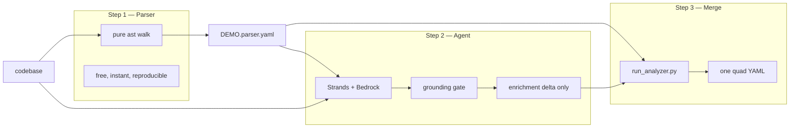
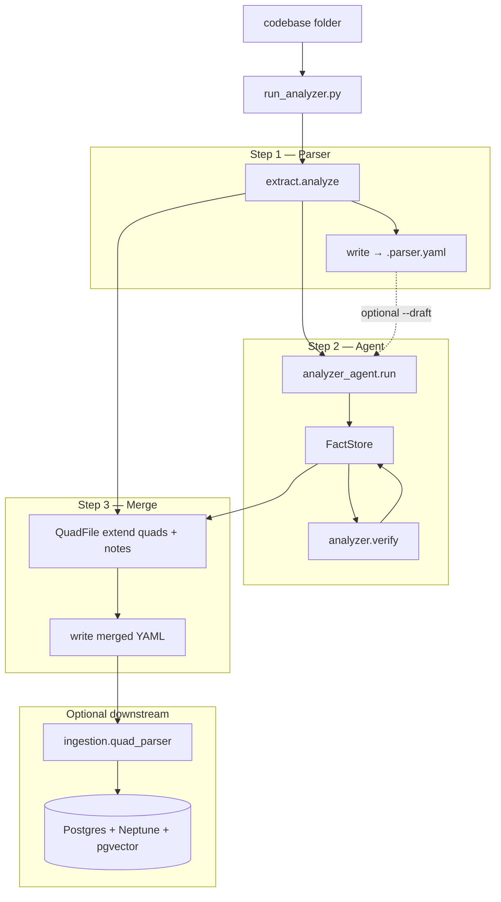
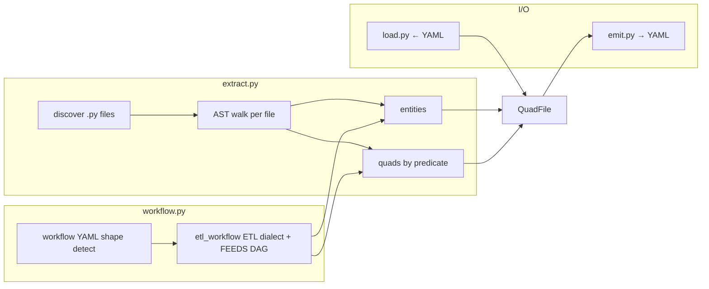
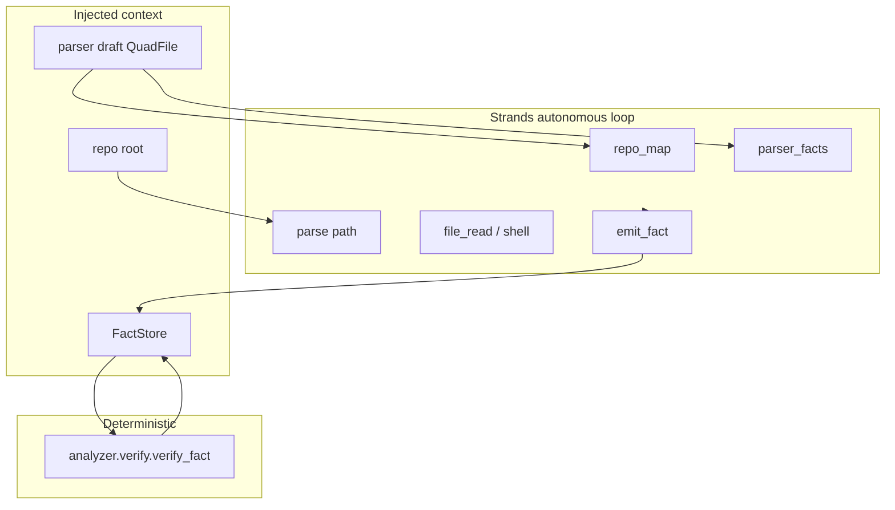

# Analyzer Module — Deep Architectural Review (Automated AI Platform v2)

**Audience:** Senior QA Automation Engineer with zero prior knowledge of this codebase.  
**Goal:** After reading this document, you can maintain, debug, and extend the Analyzer without speaking to the original author.

**Bundle location:** `analyzer/` — self-contained; parser + agent + merge in one package.

| Package | Path | Role |
|---------|------|------|
| **Step 1 — Parser** | `analyzer/` | Deterministic AST + workflow extraction (no LLM) |
| **Step 2 — Agent** | `analyzer_agent/` | Autonomous cross-file enrichment (Strands + Bedrock) |
| **Step 3 — Merge** | `run_analyzer.py` | Concatenate parser draft + agent delta → one quad YAML |

**Entry points:**

| Command | When to use |
|---------|-------------|
| `python run_analyzer.py <repo> --app-id DEMO --out DEMO.yaml` | **Recommended** — parser → agent → merge in one shot |
| `python -m analyzer` | Step 1 only (parser → quad YAML) |
| `python -m analyzer_agent` | Step 2 only (agent delta; pass `--draft` for existing parser file) |
| `core.onboard` | Full platform path (optional) — same merge logic, then `ingestion` |

**Canonical design:** `MASTER_DESIGN.md` §5.1 / §5.1.1 · `2026/solution/final_design/02_analyzer.md`

---

# Part 1: Executive Summary

## What problem does the Analyzer solve?

Before the platform can write **grounded** regression tests, it needs a **Knowledge Base** of real system facts: what functions exist, what tables they query, which Lambdas they invoke, which endpoints they expose. Someone must read the codebase and extract this spec.

Manual curation does not scale. Pure LLM extraction churns 99% on unchanged code (experiment: `2026/experiments/analyzer_ab/`). Automated AI Platform v2 uses a **three-step hybrid**:

| Step | Component | What it does |
|------|-----------|--------------|
| **1** | `analyzer` (parser) | Fast, free, **reproducible** AST parse — the canonical backbone (~9k lines of quads) |
| **2** | `analyzer_agent` | AI agent emits **enrichment delta only** — net-new cross-file facts the parser missed (~900 lines) |
| **3** | `run_analyzer.py` (merge) | Concatenate draft + verified agent facts + notes → **one merged quad YAML** for ingestion |

Every agent-emitted fact is **re-verified** at its claimed `file:line` before entering the graph.

## Why Automated AI Platform v2 exists

Automated AI Platform is **Component 0** — the onboarding front door, packaged so it runs **without** the rest of the monorepo:

```
codebase
   │
   ├─▶ Step 1  parser (deterministic)     →  DEMO.parser.yaml   (big file, untouched)
   │
   ├─▶ Step 2  agent (codebase + draft)   →  enrichment delta   (small, in memory)
   │
   └─▶ Step 3  merge (run_analyzer.py)    →  DEMO.yaml          (parser + agent → ingestion)
                                                    │
                                                    ▼
                                         ingestion → Postgres + Neptune + pgvector
                                                    │
                                                    ▼
                                         coding_agent grounds tests against KB
```

The parser and agent each produce a **partial** picture. They must be **merged** before ingestion. v1 left merge to `core.onboard`; v2 exposes merge in `run_analyzer.py` so the bundle is self-contained.

## What input does the Analyzer receive?

### Step 1 (`analyzer`)

| Input | Type | Source |
|-------|------|--------|
| App directory | `str` path | Local folder (repo root) |
| App ID | `str` | KB scope key (e.g. `DEMO`) |

### Step 2 (`analyzer_agent`)

| Input | Type | Source |
|-------|------|--------|
| Repo directory | `AnalyzerTask.repo_dir` | Same codebase root |
| App ID | `AnalyzerTask.app_id` | KB scope |
| Parser draft | `AnalyzerTask.draft` | `QuadFile` from Step 1 — **codebase + draft** is the intended design |

The agent always works from a draft: either supplied via `--draft DEMO.parser.yaml`, loaded by `run_analyzer.py` after Step 1, or built in-memory via `analyze()` if none provided.

### Step 3 (`run_analyzer.py`)

| Input | Type | Source |
|-------|------|--------|
| Parser `QuadFile` | in memory or `--draft` on disk | Step 1 output |
| Agent `FactStore` | from `run_agent()` | Step 2 output (skipped with `--no-agent`) |

Bedrock settings from `analyzer/.env` (`BEDROCK_MODEL_ARN` required for Step 2 only).

## What output does the Analyzer produce?

### On disk (via `run_analyzer.py`)

| File | Contents |
|------|----------|
| `{stem}.parser.yaml` | Step 1 only — inspect, diff against existing quad store |
| `{out}.yaml` | **Merged deliverable** — parser entities + parser quads + agent quads + notes |

Example: `--out DEMO.yaml` → `DEMO.parser.yaml` + `DEMO.yaml`.

### Step 1 in memory — `QuadFile`

```python
QuadFile(
    app_id: str,
    entities: List[Entity],    # Module, Class, Function, Method, WorkflowFile, …
    quads: List[Quad],         # predicates route ingestion
    notes: List[Note],         # empty from parser; agent fills via merge
)
```

Serialized via `analyzer.emit.write()` / `to_yaml()`. Reloaded via **`analyzer.load.load_quadfile()`** (v2 addition).

### Step 2 in memory — `FactStore`

```python
store.stats() → {
    "emitted": int,
    "graph_facts": int,      # verified → merged into quads
    "notes": int,            # behavioural → pgvector (under notes: in YAML)
    "rejected": int,
    "precision": float,
    "rejected_samples": [...],
}
```

`store.to_quadfile()` → **agent quads only** (enrichment delta).  
`store.to_notes()` → behavioural notes.

The agent **never edits** the parser file. Merge is append-only concatenation with provenance tags (`extraction_method: ast` vs `agent`).

### Typical scale

| Artifact | Approximate size | Role |
|----------|------------------|------|
| Parser draft | ~9k lines | Exhaustive backbone |
| Agent delta | ~900 lines | Cross-file / lineage gaps only |
| Merged file | parser + delta | Single handoff to ingestion |

Sandbox validation (Step 1 only): **132 entities, 279 quads, 0 quarantined** through real `quad_parser` — deterministic, ~0.1s, $0.

---

# Part 2: Core Concepts

## Why three steps (not two)?



| | **Parser (Step 1)** | **Agent (Step 2)** | **Merge (Step 3)** |
|---|---|---|---|
| Technology | Pure Python `ast` + sqlglot | Strands + Bedrock | Plain Python |
| Output size | Large (full structure) | Small (gaps only) | Combined |
| Edits parser file? | Writes `.parser.yaml` | No | No — new merged file |
| Provenance | `extraction_method: ast` | `extraction_method: agent` | Both tags preserved |

**Design Q&A (from Automated AI Platform README):**

- **Codebase + parser output?** Yes — agent reads draft via `repo_map` / `parser_facts`; does not duplicate parser facts.
- **Agent output?** Enrichment delta only; every fact verified at `file:line`.
- **Where merge happens?** `run_analyzer.py` lines that `extend` quads and notes — no separate `merger.py`.

## Parser as source of truth

The A/B experiment proved an LLM-built graph is unsuitable as the backbone: **99% churn** on unchanged code. The parser output is:

- **Exhaustive** — every file, every `def`/`class`, module-level env reads
- **Diffable** — Neptune versioning depends on stable ids
- **Contract-clean** — zero quarantine through ingestion's `quad_parser` (when ingestion package present)

The agent **builds on** the draft; it does not replace it.

## The grounding gate (shared safety layer)

`analyzer.verify.verify_fact(root, fact_dict)` — pure, deterministic, no LLM.

Every `emit_fact` routes through `FactStore.emit()`:

```
emit_fact(subject, predicate, object, file, line)
        │
        ▼
  verify_fact(root, fact)     ← reads real source at file:line
        │
        ├─ ok=True      → graph quads (merged in Step 3)
        ├─ ok=None      → notes (pgvector)
        └─ ok=False     → rejected (hallucination / wrong location)
```

Explicit `kind="note"` → straight to notes.

## Canonical identity (graph connectivity)

Ingestion's `neptune_writer` builds:

```
node id       = f"{app_id}:{type}:{qualified_name}"
edge endpoint = f"{app_id}:{quad.subject}"   (and object)
```

So `quad.subject` / `quad.object` must be **`Type:qualified-name`** ids — not file paths.

| Module | Role |
|--------|------|
| `analyzer/extract.py` | Builds ids from AST structure |
| `analyzer_agent/canonical.py` | Contract locked to `neptune_writer` f-strings |
| `tests/test_canonical.py` | Prevents drift (0%-connect bug) |

## Self-contained bundle (v2)

Automated AI Platform v2 has **no runtime dependency** on `ingestion` or `core`:

| Concern | v1 (monorepo) | v2 (Automated AI Platform) |
|---------|---------------|------------|
| Agent config | `ingestion.config.load_config` | `analyzer_agent/_env.py` |
| Merge | `core/onboarding.py` | `run_analyzer.py` |
| Ingestion contract tests | Always run | **Skip** if `ingestion` not on `PYTHONPATH` |
| Parser deps | PyYAML + ingestion | `pyyaml`, `sqlglot`, `botocore` |
| Agent deps | + strands + boto3 | Same (optional — only Step 2) |

Downstream: hand merged `DEMO.yaml` to ingestion with `QUAD_FILES_SOURCE=<dir> python -m ingestion`.

## AI Dome / guardrail (production deployment)

| Step | Model calls? | AI Dome impact |
|------|--------------|----------------|
| **Parser** | None | Unaffected |
| **Agent** | Bedrock via AI Dome | May hit `GUARDRAIL_INTERVENED` / `PROMPT_ATTACK` on repo-analysis prompts |

Until an approved code-analysis profile exists, run **`--no-agent`**. Parser-only output is complete and valid for ingestion on its own.

## The two AI agents in the system

| Agent | Phase | KB relationship |
|-------|-------|-----------------|
| **`analyzer_agent`** (Step 2) | Onboarding | **Builds** the KB |
| **`coding_agent`** | Per-change | **Consumes** the KB |

---

# Part 3: Complete Architecture

## Pipeline position



## Step 1 — Parser architecture



## Step 2 — Agent architecture

(Unchanged from v1 — autonomous loop over codebase + draft.)



## Step 3 — Merge (run_analyzer.py)

```python
merged = QuadFile(app_id=..., entities=draft.entities,
                  quads=list(draft.quads), notes=list(draft.notes))
merged.quads.extend(store.to_quadfile().quads)   # + agent graph facts
merged.notes.extend(store.to_notes())            # + agent notes
write(merged, args.out)
```

Sets do not overlap by design (agent instructed not to duplicate; identical canonical ids would collapse). Merge is **clean concatenation** of two provenance-tagged fact sets.

## Module dependency diagram

```
analyzer/
  run_analyzer.py
    ├── analyzer.analyze / load_quadfile / write
    └── analyzer_agent.run(AnalyzerTask)

  analyzer/
    __init__.py → analyze, load_quadfile, to_yaml, write
    extract.py  → ast + sqlglot + botocore S3 model
    workflow.py → YAML workflow dialect (etl_workflow)
    emit.py     → QuadFile → YAML
    load.py     → YAML → QuadFile          ← v2
    verify.py   → grounding gate
    models.py   → Entity, Quad, QuadFile, Note

  analyzer_agent/
    _env.py     → self-contained .env loader  ← v2
    config.py   → bedrock + analyzer knobs
    agent.py    → build_agent, run
    store.py    → FactStore.emit → verify → route
    canonical.py, prompts.py, hooks.py, tools/

  (optional) core/onboarding.py — same merge pattern + ingestion.load
```

---

# Part 4: Step 1 — What the Parser Extracts

## Entities (nodes)

| Type | Source |
|------|--------|
| `Module` | Each `.py` file |
| `Class` | `class` definitions |
| `Function` | Module-level `def` |
| `Method` | Methods inside classes |
| `WorkflowFile` / `Step` | etl_workflow-style YAML with `actions[]` |

Each entity has `file:line` in `Source`.

## Quads (edges) — predicates ingestion routes on

| Predicate | Detected from | Ingestion destination |
|-----------|---------------|----------------------|
| `EXPOSES_ENDPOINT` | FastAPI `@app.get` / Flask `@app.route` | `app_endpoints` |
| `READS_FROM_S3` · `WRITES_TO_S3` | boto3 S3 ops (botocore model) | `app_s3_paths` |
| `INVOKES_LAMBDA` · `INVOKES_STEP_FUNCTION` | `client.invoke` / `start_execution` | `app_service_invocations` |
| `READS_ENV_VAR` | `os.environ` / `os.getenv` | `app_parameters` |
| `QUERIES_DATABASE` · `WRITES_DATABASE` | SQL via sqlglot | `app_tables` |
| `CALLS` | Function calls (same-file resolved; cross-file often `[UNRESOLVED]`) | Neptune edge |
| `DEFINES` | module/class → members | Neptune edge |
| `FEEDS` | Workflow data-flow DAG | Neptune edge |

## Honest by construction

| Source in code | `resolved` flag | Downstream |
|----------------|-----------------|------------|
| String literal | `True` | Direct KB fact |
| Variable reference | `False` | Ingestion bindings resolver |
| Unresolved cross-file call | `False` on `CALLS` | **Agent's job** |

The parser **never guesses** a value.

## Workflow YAML (etl_workflow dialect)

`workflow.py` detects by **shape** (`actions[]` with `action` keys) — not filename.

- Known actions: `EXTRACT`, `LOAD`, `MERGE`, `PURGE`, `EXECUTE`, `TRANSFORM`
- Resources via `${…}` / `s3://` convention
- Unknown action types → **flagged**, never silently dropped

---

# Part 5: Step 2 — Agent Tools

## Tool inventory

| Tool | Source | Purpose |
|------|--------|---------|
| `file_read` | Strands built-in | Deep-read along call chains (repo-confined) |
| `shell` | Strands built-in | grep, glob (read-only) |
| `repo_map` | Domain | Whole-repo map from parser draft |
| `parser_facts` | Domain | Backbone + gaps (`only_unresolved=true`) |
| `parse(path)` | Domain | Level 2 — live re-parse one file |
| `emit_fact` | Domain | **Only write** — verified before kept |
| `lsp_resolve` | Domain (optional) | When `ANALYZER_LSP_ENDPOINT` set |

## Two levels of parser access

| Level | Mechanism | When |
|-------|-----------|------|
| **Level 1** | Upfront draft (from Step 1 or `--draft`) | Always — backbone |
| **Level 2** | `parse(path)` on demand | Missing file or clean canonical facts |

## emit_fact contract

```python
emit_fact(
    subject: str,      # "Function:web.app.topology.build_topology"
    predicate: str,    # CALLS | QUERIES_DATABASE | FEEDS | …
    object: str,
    file: str,
    line: int,
    kind: str = "fact",  # "fact" | "note"
    note: str = "",
) -> str              # "[graph] …" | "[rejected] …" | "[note] …"
```

## Repo confinement

`RepoGuard` + `RepoConfinementHook` — read-only cage; no filesystem writes except structured `emit_fact`.

---

# Part 6: Grounding Gate Deep Dive

(Same logic as v1 — shared `analyzer/verify.py`.)

## verify_fact summary

| Predicate | Pass condition |
|-----------|----------------|
| `EXPOSES_ENDPOINT` | Path or blueprint suffix in window |
| `CALLS` | Callee name in window |
| `QUERIES_DATABASE` / `WRITES_DATABASE` | Table/SQL/ORM present |
| `READS_FROM_S3` / `WRITES_TO_S3` | S3/boto3 op present |
| `READS_ENV_VAR` | Var + environ/getenv |
| `INVOKES_LAMBDA` | invoke or name |
| `FEEDS` | Subject or object in window |
| *unknown* | Object token must appear |

## FactStore routing

```python
def emit(self, fact: EmittedFact) -> Tuple[str, str]:
    if fact.kind == "note": → notes
    ok, why = verify_fact(self.root, fact.as_check())
    if ok is True:  → verified (graph)
    if ok is None:  → notes
    if ok is False: → rejected
```

---

# Part 7: End-to-End Execution Flow

## Recommended: `run_analyzer.py` (all three steps)

```bash
cd analyzer
export PYTHONPATH=.
python run_analyzer.py <repo> --app-id DEMO --out DEMO.yaml
```

```mermaid
sequenceDiagram
    participant User
    participant Run as run_analyzer.py
    participant Par as analyze
    participant Agent as analyzer_agent.run
    participant Merge as merge + write

    User->>Run: --out DEMO.yaml
    Run->>Par: analyze(repo, app_id)  [unless --draft]
    Par-->>Run: draft QuadFile
    Run->>Run: write(draft, DEMO.parser.yaml)

    alt --no-agent OR agent failure
        Run->>Merge: merged = copy(draft)
    else agent runs
        Run->>Agent: AnalyzerTask(repo, app_id, draft)
        Agent-->>Run: FactStore
        Run->>Merge: extend quads + notes from store
    end

    Run->>Merge: write(merged, DEMO.yaml)
    Run-->>User: DEMO.parser.yaml + DEMO.yaml
```

### CLI flags

| Flag | Effect |
|------|--------|
| `--out DEMO.yaml` | Required — path for merged output |
| `--draft DEMO.parser.yaml` | Skip re-parse; load existing parser quad |
| `--no-agent` | Parser only — no Bedrock, no AI Dome |

## Standalone Step 1

```bash
PYTHONPATH=. python -m analyzer <repo> --app-id DEMO --out DEMO.parser.yaml --stats
```

## Standalone Step 2

```bash
PYTHONPATH=. python -m analyzer_agent <repo> --app-id DEMO \
  --draft DEMO.parser.yaml --out DEMO.agent.yaml
```

`--out` on `analyzer_agent` writes **agent facts only** — use `run_analyzer.py` for the merged file.

## Via `core.onboard` (platform integration)

When running inside the full `automated_ai_platform` monorepo, `core/onboarding.py` performs the same merge pattern and optionally calls `ingestion.run_pipeline`. Automated AI Platform v2 does not require this path for producing the merged quad file.

| Step | Action |
|------|--------|
| 1 | `source.resolve` → local root |
| 2 | `analyze()` → draft |
| 3 | `run_agent(AnalyzerTask(draft=draft))` if Bedrock configured |
| 4 | merge quads + notes |
| 5 | write `{app_id}.yaml` |
| 6 | `ingestion.run_pipeline` if Postgres configured |

---

# Part 8: Data Model

## Entity / Quad / Note / QuadFile

(Same shapes as v1 — see `analyzer/models.py`.)

## load_quadfile (v2)

```python
from analyzer import load_quadfile
draft = load_quadfile("DEMO.parser.yaml")
```

Inverse of `emit.write()` — tolerant of missing optional fields. Enables **codebase + existing parser file** without re-parsing.

## Merged YAML shape

One file with:

```yaml
metadata: { app_id: DEMO, ... }
entities: [...]          # from parser
quads: [...]             # parser (extraction_method: ast) + agent (extraction_method: agent)
notes: [...]             # agent behavioural notes → pgvector
```

---

# Part 9: Configuration

## Automated AI Platform `.env` (`analyzer/.env.example`)

| Key | Required for | Meaning |
|-----|--------------|---------|
| `BEDROCK_MODEL_ARN` | Step 2 only | Model / inference-profile ARN — **never defaulted** |
| `AWS_REGION` | Step 2 | Bedrock region (default `us-east-1`) |
| `ANALYZER_LANGUAGES` | Step 2 | Default `python` |
| `ANALYZER_MAX_ITERATIONS` | Step 2 | Loop cap (settings dict) |
| `ANALYZER_LSP_ENDPOINT` | Step 2 | Optional LSP; empty → tool off |

**Parser needs no `.env` entries.** Leave `BEDROCK_MODEL_ARN` blank → parser-only behaviour.

Loaded by `analyzer_agent/_env.py` — walks cwd and parents for `.env`; never overrides existing env vars.

## Install

```bash
python3.11 -m venv .venv && source .venv/bin/activate

# Step 1
pip install pyyaml sqlglot botocore

# Step 2 (optional)
pip install strands-agents strands-agents-tools boto3
```

## Dependency floor

```
Step 1:  stdlib + pyyaml + sqlglot + botocore
Step 2:  + strands + strands_tools + boto3 + analyzer package
Step 3:  stdlib only (run_analyzer.py)
```

**No** LangChain / LangGraph. **No** hardcoded name-lists in agent package.

---

# Part 10: File Reference

### `analyzer/`

| File | Purpose |
|------|---------|
| `__main__.py` | CLI: `python -m analyzer` |
| `extract.py` | AST parser — code → entities + quads |
| `workflow.py` | YAML workflow dialect + FEEDS |
| `emit.py` | QuadFile → ingestion-compatible YAML |
| `load.py` | YAML → QuadFile (**v2**) |
| `models.py` | Entity, Quad, QuadFile, Note, Source |
| `verify.py` | Grounding gate (shared with agent) |

### `analyzer_agent/`

| File | Purpose |
|------|---------|
| `__main__.py` | CLI with `--draft` support |
| `_env.py` | Self-contained `.env` loader (**v2**) |
| `agent.py` | Strands assembly, `AnalyzerTask`, `run()` |
| `store.py` | FactStore — emit routing + quad serialization |
| `canonical.py` | `Type:qualified-name` id contract |
| `config.py` | Bedrock + analyzer knobs |
| `prompts.py`, `hooks.py`, `tools/*` | Agent loop |

### `run_analyzer.py`

| Role |
|------|
| Front door: Step 1 → Step 2 → Step 3 merge |
| Writes `.parser.yaml` + merged output |
| Graceful agent skip on missing Bedrock / guardrail / Strands |

---

# Part 11: Call Graph

```
run_analyzer.py main()
  ├── [Step 1] analyze(repo, app_id)  OR  load_quadfile(--draft)
  ├── write(draft, {out}.parser.yaml)
  ├── merged = copy(draft)
  ├── [Step 2] run_agent(AnalyzerTask(repo, app_id, draft))   [unless --no-agent]
  │     ├── build_agent()
  │     │     ├── set_draft / set_store / set_root
  │     │     └── strands.Agent(tools, hooks)
  │     └── agent(task_prompt)
  │           └── emit_fact → FactStore.emit → verify_fact
  ├── [Step 3] merged.quads.extend(store.to_quadfile().quads)
  │            merged.notes.extend(store.to_notes())
  └── write(merged, --out)
```

---

# Part 12: Recommended Reading Order

| Order | File | Why |
|-------|------|-----|
| **1** | `analyzer/README.md` | Q&A, install, three-step overview |
| **2** | `run_analyzer.py` | Merge logic — the v2 spine |
| **3** | `analyzer/models.py` | Entity / Quad / QuadFile |
| **4** | `analyzer/extract.py` | Parser extraction |
| **5** | `analyzer/load.py` | Reload parser draft from disk |
| **6** | `analyzer/verify.py` | Grounding gate |
| **7** | `analyzer_agent/store.py` | Agent output routing |
| **8** | `analyzer_agent/agent.py` | Strands wiring |
| **9** | `analyzer_agent/tools/emit_fact.py` | Only write path |
| **10** | `ingestion/parsers/quad_parser.py` | Downstream contract (if bundled) |
| **11** | `docs/onboarding/CODING_AGENT_ARCHITECTURE.md` | KB consumer |

---

# Part 13: Explain Like I'm Five

**Step 1 (parser)** is a surveyor with a measuring tape — every street, every address, same result every time. They write a big book (`DEMO.parser.yaml`).

**Step 2 (agent)** is a detective with the big book and the keys to the buildings. They find secret tunnels between basements (cross-file calls) the surveyor couldn't see from the sidewalk. Every tunnel claim is checked at the exact file and line they cite.

**Step 3 (merge)** is the clerk who staples the surveyor's book and the detective's addendum into **one atlas** (`DEMO.yaml`) — without changing the original survey. That atlas goes to the city archive (ingestion → KB).

---

# Part 14: Failure Modes and Debugging

| Symptom | Likely cause | Where to look |
|---------|--------------|---------------|
| 0 agent graph facts | Couldn't ground cross-file flows | `store.stats()["rejected_samples"]` |
| Agent skipped | No `BEDROCK_MODEL_ARN` / guardrail / Strands missing | stderr from `run_analyzer.py` |
| `GUARDRAIL_INTERVENED` | AI Dome policy on repo prompts | Run `--no-agent`; parser-only valid |
| Low precision (<80%) | Agent guessing locations | `verify.py` rejection reasons |
| Graph doesn't connect | Id scheme drift | `test_canonical.py` |
| Merged file = parser only | `--no-agent` or agent exception swallowed | `run_analyzer.py` Step 2 log |
| `parse(path)` ids mismatch | Wrong repo root | `tools/context.py` |
| Ingestion quarantine | YAML shape mismatch | `test_analyzer.py` (skips if no ingestion) |

---

# Appendix: Running Examples

```powershell
cd <repo-root>\analyzer
$env:PYTHONPATH = "."

# Recommended — parser → agent → merge
py -3.12 run_analyzer.py c:\path\to\app --app-id DEMO --out DEMO.yaml

# Parser only (no Bedrock, no AI Dome)
py -3.12 run_analyzer.py c:\path\to\app --app-id DEMO --out DEMO.yaml --no-agent

# Reuse existing parser draft
py -3.12 run_analyzer.py c:\path\to\app --app-id DEMO --out DEMO.yaml --draft DEMO.parser.yaml

# Steps separately
py -3.12 -m analyzer c:\path\to\app --app-id DEMO --out DEMO.parser.yaml --stats
py -3.12 -m analyzer_agent c:\path\to\app --app-id DEMO --draft DEMO.parser.yaml --out DEMO.agent.yaml
```

## Hand off to ingestion

```powershell
# After run_analyzer.py produces DEMO.yaml:
$env:QUAD_FILES_SOURCE = "c:\path\to\quad\dir"
py -3.12 -m ingestion   # requires ingestion package + PG_* in .env
```

## Test suites

```powershell
cd <repo-root>\analyzer
$env:PYTHONPATH = "."
py -3.12 -m pytest analyzer/tests analyzer_agent/tests -q
```

Ingestion contract tests (`test_ingestion_contract_zero_quarantine`, `test_workflow_output_feeds_ingestion`) **skip automatically** when `ingestion` is not on the path — normal for the analyzer-only bundle.

---

*Document version: aligned with `analyzer/` (Automated AI Platform v2). For package READMEs see `analyzer/README.md`. For KB consumer see `docs/onboarding/CODING_AGENT_ARCHITECTURE.md`.*

# Analyzer Example (Automated AI Platform v2 — Step 1: Parser)

This example walks through **Step 1 only** — the deterministic parser — and the file it writes to disk. In Automated AI Platform v2 the parser never calls a model; its output is the **backbone** the agent reads in Step 2.

**Run (parser only):**

```bash
cd analyzer
PYTHONPATH=. python run_analyzer.py project/ --app-id DEMO --out DEMO.yaml --no-agent
# or: PYTHONPATH=. python -m analyzer project/ --app-id DEMO --out DEMO.parser.yaml --stats
```

**On disk:** `DEMO.parser.yaml` (parser draft). With `--no-agent`, `DEMO.yaml` is a copy of the same draft — no agent quads yet.

---

## Project Structure

```text
project/
├── math.py
└── api.py
```

---

## File 1: `math.py`

```python
def add(a, b):
    return a + b
```

### Entities Generated

```text
Module:math
Function:math.add          (file: math.py, line 1)
```

### Quads Generated

```text
Function:math.add --DEFINES--> Function:math.add   (module defines its member)
```

No endpoint, database, S3, Lambda, or env-var quads — `add` only computes a value.

---

## File 2: `api.py`

```python
from math import add

@app.get("/sum")
def sum_api():
    return add(1, 2)
```

### Entities Generated

```text
Module:api
Function:api.sum_api       (file: api.py, line 4)
```

---

## Quads Generated (same-file + resolved import)

### Quad 1 — endpoint

```text
Subject   : Function:api.sum_api
Predicate : EXPOSES_ENDPOINT
Object    : APIEndpoint:GET /sum
Resolved  : true
File      : api.py:3
Method    : ast
```

The parser read the FastAPI decorator `@app.get("/sum")`.

### Quad 2 — call (resolved within one analyze pass)

```text
Subject   : Function:api.sum_api
Predicate : CALLS
Object    : Function:math.add
Resolved  : true
File      : api.py:6
Method    : ast
```

The parser saw `from math import add` and linked the call site to the canonical callee id `Function:math.add`.

---

# Step 1 Output — `DEMO.parser.yaml`

The parser writes a **QuadFile** serialized to YAML. Every quad carries `extraction_method: ast`:

```yaml
metadata:
  app_id: DEMO
  generated_by: analyzer-python-v1
entities:
  - id: Module:math
    type: Module
    name: math
    source: { file_path: math.py, line_start: 1 }
  - id: Function:math.add
    type: Function
    name: math.add
    source: { file_path: math.py, line_start: 1 }
  - id: Module:api
    type: Module
    name: api
    source: { file_path: api.py, line_start: 1 }
  - id: Function:api.sum_api
    type: Function
    name: api.sum_api
    source: { file_path: api.py, line_start: 4 }
quads:
  - subject: Function:api.sum_api
    predicate: EXPOSES_ENDPOINT
    object: APIEndpoint:GET /sum
    context:
      file_path: api.py
      line_start: 3
      extraction_method: ast
      resolved: true
  - subject: Function:api.sum_api
    predicate: CALLS
    object: Function:math.add
    context:
      file_path: api.py
      line_start: 6
      extraction_method: ast
      resolved: true
notes: []
```

This file is **left untouched** after Step 2 — use it to diff against an existing quad store.

---

# Parser Flow (Step 1)

```text
project/  (codebase)
      │
      ▼
analyze(app_dir, app_id="DEMO")     ← extract.py, pure ast
      │
      ├── discover all .py files
      ├── build entities (Type:qualified-name ids)
      ├── emit quads (predicates route to ingestion)
      └── workflow YAML (if etl_workflow actions[] present)
      │
      ▼
QuadFile in memory
      │
      ▼
write(draft, DEMO.parser.yaml)      ← emit.py
```

---

## Key Takeaways (Step 1)

- **Entity** → A code unit with a canonical id (`Function:math.add`), not a bare name (`add`).
- **Quad** → A typed relationship; `extraction_method: ast` marks parser provenance.
- **QuadFile** → Step 1 deliverable on disk is **`DEMO.parser.yaml`** — the big, reproducible backbone.
- **No model** → Step 1 is free, instant, and byte-identical for the same input.
- **Step 2 reads this file** — the agent gets **codebase + draft**, not the codebase alone.


# Analyzer Agent Example (Automated AI Platform v2 — Steps 2 & 3)

This example shows where the **agent enrichment delta** fits and how **`run_analyzer.py`** merges it with the parser draft into **one** ingestion-ready file.

**Run (all three steps):**

```bash
cd analyzer
PYTHONPATH=. python run_analyzer.py project/ --app-id DEMO --out DEMO.yaml
```

**On disk after a successful run:**

| File | Role |
|------|------|
| `DEMO.parser.yaml` | Step 1 — parser backbone (unchanged after merge) |
| `DEMO.yaml` | Step 3 — **merged** parser quads + agent quads + notes |

---

## Project Structure

```text
project/
├── user.py
└── helper.py
```

Cross-file `from helper import *` — the parser cannot pin the callee id without reading both files.

---

## File 1: `user.py`

```python
from helper import *

def login():
    notify()
```

---

## File 2: `helper.py`

```python
def notify():
    pass
```

---

# Step 1 – Parser writes `DEMO.parser.yaml`

The parser finds both functions but leaves the cross-file call **unresolved**:

### Entities (excerpt)

```text
Module:user
Function:user.login          (user.py:4)

Module:helper
Function:helper.notify       (helper.py:1)
```

### Quad — unresolved gap (agent's job)

```text
Subject   : Function:user.login
Predicate : CALLS
Object    : Symbol:notify
Resolved  : false
File      : user.py:5
Method    : ast
```

`parser_facts(only_unresolved=true)` surfaces exactly this row — the agent must not re-emit it unchanged; it must **resolve** the callee to `Function:helper.notify`.

---

# Step 2 – Agent (codebase + draft)

The agent receives `AnalyzerTask(repo_dir="project/", app_id="DEMO", draft=<Step 1 QuadFile>)`.

### 2a — Orient from the draft

```text
repo_map()
```

Shows every module and canonical id — agent uses these ids in `emit_fact`, never bare names.

### 2b — Find gaps

```text
parser_facts(only_unresolved=true)
```

```text
Function:user.login --CALLS--> Symbol:notify  (user.py:5)  [UNRESOLVED]
```

### 2c — Read source across files

Opens `user.py` → sees `notify()` at line 5.  
Greps / reads `helper.py` → finds `def notify():` → canonical id `Function:helper.notify`.

### 2d — Emit one enrichment fact (not a full re-parse)

```text
emit_fact(
  subject   = "Function:user.login",
  predicate = "CALLS",
  object    = "Function:helper.notify",
  file      = "user.py",
  line      = 5,
  kind      = "fact"
)
→ "[graph] callee name present"
```

### 2e — Grounding gate

```text
verify_fact(root, fact)  →  ✔ PASS  (notify visible in user.py window)
```

### Agent delta in memory (small — not written over the parser file)

```text
FactStore:
  verified:  1 quad   (extraction_method: agent)
  rejected:  0
  notes:     0
```

The agent does **not** duplicate the parser's entities or its unresolved quad. It adds **one** resolved cross-file edge.

---

# Step 3 – Merge in `run_analyzer.py`

Merge is append-only — the parser YAML is never edited:

```python
merged = QuadFile(app_id="DEMO",
                  entities=list(draft.entities),    # all parser entities
                  quads=list(draft.quads),          # parser quads (incl. unresolved)
                  notes=list(draft.notes))
merged.quads.extend(store.to_quadfile().quads)      # + 1 agent quad
merged.notes.extend(store.to_notes())
write(merged, "DEMO.yaml")
```

### Console output (typical)

```text
[1/3] parser: 4 entities, 3 quads -> DEMO.parser.yaml
[2/3] agent: +1 verified facts, +0 notes (rejected 0, precision 100.0/100)
[3/3] MERGED -> DEMO.yaml: 4 entities, 4 quads (3 parser + 1 agent), 0 notes
```

---

# Final Merged `DEMO.yaml` (excerpt)

Parser quads and agent quads coexist; provenance tells them apart:

```text
QuadFile (merged — hand to ingestion)
│
├── entities: [... same 4 as DEMO.parser.yaml ...]
│
├── quads:
│   ├── Function:user.login --CALLS--> Symbol:notify
│   │       extraction_method: ast      resolved: false   ← parser gap (still present)
│   │
│   ├── Function:user.login --CALLS--> Function:helper.notify
│   │       extraction_method: agent    resolved: true    ← agent enrichment
│   │
│   └── ... other parser quads ...
│
└── notes: []
```

Ingestion loads both; the **agent quad** is the resolved edge that connects the graph. The unresolved parser quad may remain until bindings or a later pass clears it — the agent was told not to duplicate parser facts, only to add what it can ground.

---

# Full Three-Step Flow (Automated AI Platform v2)

```text
Codebase
      │
      ├─▶ Step 1  analyze()           →  DEMO.parser.yaml   (big, ast, untouched)
      │
      ├─▶ Step 2  agent(codebase + draft)  →  enrichment delta in FactStore (small)
      │           repo_map → parser_facts(unresolved) → read files → emit_fact → verify_fact
      │
      └─▶ Step 3  run_analyzer.py merge  →  DEMO.yaml   (parser + agent → ingestion)
```

---

## Key Takeaways (Steps 2 & 3)

- The agent always works from **codebase + parser draft** — pass `--draft DEMO.parser.yaml` to skip re-parsing.
- Agent output is an **enrichment delta** (few quads), not a second full spec.
- Every agent fact is **verified at file:line** before merge; rejected facts never reach `DEMO.yaml`.
- **Merge** happens in `run_analyzer.py` — concatenation with `extraction_method: ast` vs `agent` tags.
- **`DEMO.parser.yaml` is never edited** — compare it to your existing store; ship **`DEMO.yaml`** to ingestion.
- Use **`--no-agent`** when Bedrock / AI Dome is unavailable — parser-only output is valid on its own.
