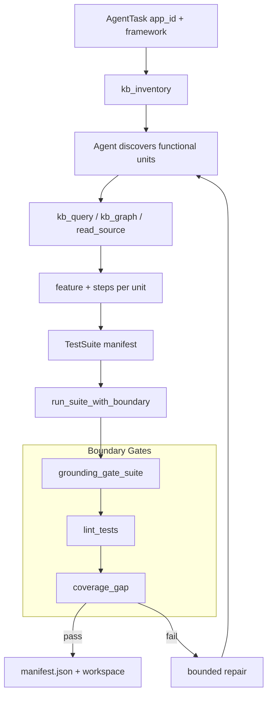
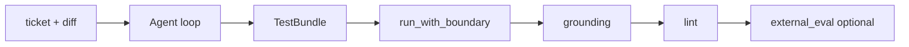

# Coding Agent Module — Deep Architectural Review (Automated AI Platform v2)

**Audience:** Senior QA Automation Engineer with zero prior knowledge of this codebase.  
**Goal:** After reading this document, you can maintain, debug, and extend the Coding Agent without speaking to the original author.

**Bundle location:** `Coding Agent v2/` — self-contained: agent + bundled `validator/`.

| Package | Path | Role |
|---------|------|------|
| **Coding Agent** | `Coding Agent v2/coding_agent/` | Strands + Bedrock agent, boundary, KB tools, run log |
| **Validator** | `Coding Agent v2/validator/` | Static linter behind `lint_tests` (stdlib, no Strands) |

**Entry points:**

| Command / API | Mode |
|---------------|------|
| `python -m coding_agent task.json` | Auto-routes: no `diff` → whole-app; with `diff` → per-change |
| `run_suite_with_boundary(task)` | Whole-app functional suite (default) |
| `run_with_boundary(task, external_eval=…)` | Per-change regression (legacy) |
| `core.generate.generate` | Platform integration (monorepo, optional Eval injection) |

**Canonical design:** `2026/solution/final_design/04_coding_agent_agentic.md` · `MASTER_DESIGN.md` §6

---

# Part 1: Executive Summary

## What problem does the Coding Agent solve?

After an application is **onboarded into the Knowledge Base**, someone must write **functional tests** that exercise real journeys, workflows, pipelines, and service entry points — using **real** KB names, **real** invocation paths, and the **correct** test framework. Manual authoring is slow; naive AI generation produces:

- **Hallucinated identifiers** — plausible Lambda or table names that do not exist
- **Unit tests for every helper** instead of end-to-end functional coverage
- **Fake-pass tests** — in-memory context asserted without calling real code
- **Incomplete coverage** — some KB units never tested or accounted for
- **Framework violations** — duplicate steps, invalid Gherkin, hardcoded secrets

Automated AI Platform v2 is an **autonomous Strands + Bedrock agent** inside a **deterministic boundary**. The model writes; plain code judges (grounding, lint, coverage, optional Eval).

## Two modes, same agent

| Mode | Trigger | Output | Boundary entry |
|------|---------|--------|----------------|
| **Whole-app** (default) | `AgentTask` with `framework` + `scope.app_id` only — **no diff** | Full functional suite + `TestSuite` manifest | `run_suite_with_boundary()` |
| **Per-change** (legacy) | Also supply `ticket_text` + `diff` | One regression `TestBundle` | `run_with_boundary()` |

CLI routes automatically in `__main__.py`: `if task.diff.strip()` → per-change, else whole-app.

## Why does the Coding Agent exist?

```
ONBOARDING   analyzer → ingestion → KB
GENERATION   Coding Agent v2 → [Eval] → delivered test suite
```

The agent **consumes** the KB. Without onboarding, `kb_query` / `kb_inventory` return empties.

## What input does the agent receive?

### Whole-app (minimal)

```json
{
  "framework": "behave",
  "scope": { "app_id": "demo_app" }
}
```

### Per-change (legacy)

```json
{
  "ticket_id": "ETSAPS-1",
  "ticket_text": "Charge a 5% late fee when payment is >15 days overdue.",
  "diff": "--- a/late_fee.py\n+++ b/late_fee.py\n@@ ...",
  "framework": "behave",
  "scope": { "app_id": "DEMO" }
}
```

### All `AgentTask` fields

| Field | Required | Meaning |
|-------|----------|---------|
| `framework` | ✅ | `behave` / `cucumber` / `karate` / `selenium` / `playwright` — PO chooses; agent never infers |
| `scope.app_id` | ✅ | Onboarded app — scopes every KB lookup |
| `workspace_dir` | optional | Scoped write/run folder — **defaults to fresh temp** (`aap_ws_*`) |
| `codebase_zip` | optional | `.zip` or folder of raw source — enables `read_source` / `search_source` / `list_source` |
| `ticket_id` / `ticket_text` / `diff` | per-change only | Jira ticket + unified diff |

Connection settings from `Coding Agent v2/.env` via `coding_agent/_env.py` — never hardcoded.

## What output does the agent produce?

### Workspace on disk (both modes)

```
<workspace>/
├── features/
│   ├── <unit_a>.feature          one feature per functional unit
│   └── steps/
│       └── <unit_a>_steps.py     own steps file per feature
├── manifest.json                 whole-app only — TestSuite index
└── agent_log.txt                 full run trace (always written)
```

### Whole-app — `SuiteOutcome`

```python
SuiteOutcome(
    delivered: bool,
    suite: Optional[TestSuite],
    attempts: int,
    gate_reasons: List[str],
    coverage_gaps: List[str],      # KB units not accounted for
    routed_to_human: bool,
)
```

**`TestSuite`** manifest (structured output; files live on disk):

```python
TestSuite(
    framework: str,
    app_id: str,
    entries: List[ManifestEntry],    # one per unit: tested | skipped + reason
    skipped_types: List[SkippedType],  # whole entity types declared not-testable
    provenance: str,
)
```

### Per-change — `BoundaryOutcome`

```python
BoundaryOutcome(
    delivered: bool,
    bundle: Optional[TestBundle],
    attempts: int,
    gate_reasons: List[str],
    routed_to_human: bool,
)
```

CLI exit code: `0` = delivered, `1` = routed to human.

## What does DELIVERED mean?

### Whole-app gates

1. **Grounding gate** — every `grounded_identifiers` across all tested manifest entries resolves in KB
2. **Lint gate** — no ERROR findings in workspace step files (`validator`)
3. **Coverage gate** — every KB inventory unit is **accounted for**: tested, individually skipped, or covered by a `skipped_types` verdict

### Per-change gates

1. **Grounding gate** — all `TestBundle.grounded_identifiers` resolve
2. **Lint gate** — no ERROR findings
3. **External Eval** (optional) — when `external_eval` callback supplied by `core.generate`

Bounded repair feeds gate failures (including coverage gaps) back to the agent; default `max_repairs=2` (whole-app example uses `1` in README).

## The two AI agents in the system

| Agent | Phase | KB relationship |
|-------|-------|-----------------|
| **`analyzer_agent`** (Automated AI Platform analyzer v2) | Onboarding | **Builds** the KB |
| **`coding_agent`** (this) | Generation | **Consumes** the KB |

---

# Part 2: Core Concepts

## Autonomous inside a cage

```
┌──────────────────────────────────────────────────────────────┐
│  DETERMINISTIC BOUNDARY (plain Python, no LLM)               │
│  ┌────────────────────────────────────────────────────────┐  │
│  │  STRANDS AGENT — discovers, grounds, writes files      │  │
│  │  • kb_inventory → discover units (whole-app)             │  │
│  │  • kb_query / kb_graph → ground every name               │  │
│  │  • read_source* → raw code escape hatch                  │  │
│  │  • emits TestSuite or TestBundle (structured output)     │  │
│  └────────────────────────────────────────────────────────┘  │
│  Gates: grounding → lint → [coverage] → [external Eval]      │
│  Repair: inject findings → re-run agent (bounded)            │
│  Log: agent_log.txt (RunLogger)                              │
└──────────────────────────────────────────────────────────────┘
```

**Prompt = guidance. Boundary = guarantee.**

## Functional, not unit

v2 prompt explicitly targets **journeys, workflows, pipelines, service entry points** — not every internal `Function`. Internal helpers can be marked **not-testable** via `skipped_types` rather than tested one-by-one.

## Discover from KB — nothing hardcoded

The agent calls `kb_inventory(app_id)` first in whole-app mode. It reports whatever entity types the parser recorded (`WorkflowFile`, `LambdaHandler`, `Function`, …). The **agent** decides which groups are functional units vs internal helpers — the boundary only checks that **every unit was accounted for**.

## KB first; raw source as escape hatch

| Layer | Tools | When |
|-------|-------|------|
| Facts + graph | `kb_query`, `kb_graph`, `kb_inventory` | Always (Postgres required) |
| Raw code | `list_source`, `search_source`, `read_source` | Only if `codebase_zip` set; else actionable degrade note |

Implements planned `kb_raw_code` (MASTER_DESIGN §6.3): pointer injected via `set_source(task.codebase_zip)`.

## Agent loop fix (Strands ≥1.x)

v2 runs the **full agentic loop** before structured output:

```python
result = agent(prompt, structured_output_model=TestSuite)  # or TestBundle
suite = result.structured_output
```

The old `agent.structured_output()` alone short-circuited the loop and returned empty bundles.

## Eval is not a tool

`external_eval(bundle) -> (ok, reasons)` is injected into `run_with_boundary` by `core.generate`. The agent cannot reward-hack the judge.

---

# Part 3: Complete Architecture

## Whole-app pipeline



## Per-change pipeline (legacy)



## Module dependency diagram

```
Coding Agent v2/
  coding_agent/
    __main__.py          routes whole-app vs per-change
    schemas.py           AgentTask, TestBundle, TestSuite, ManifestEntry
    agent.py             build_agent, task_prompt, domain_tools
    boundary.py          run_suite_with_boundary, run_with_boundary, coverage_gap
    run_log.py           RunLogger → agent_log.txt
    _env.py              self-contained .env loader
    config.py            bedrock + postgres accessors
    kb/facts.py          KBClient + inventory()
    kb/graph.py          GraphClient (optional Neptune)
    tools/
      kb_inventory.py    whole-app discovery
      kb_query.py        fact lookup
      kb_graph.py        lineage walk
      read_source.py     raw code trio
      lint_tests.py      → validator/
    hooks.py             workspace confinement
    prompts.py           SYSTEM_PROMPT (functional, generic)
  validator/             static linter (bundled)
```

---

# Part 4: Tools Reference

| Tool | Class | Purpose |
|------|-------|---------|
| `kb_inventory` | Domain | **Call first** in whole-app — full app surface grouped by entity type + endpoints |
| `kb_query` | Domain | Resolve identifier from Postgres facts |
| `kb_graph` | Domain | Neptune lineage walk (optional degrade) |
| `list_source` | Domain | Glob files in raw source (`codebase_zip`) |
| `search_source` | Domain | Grep raw source |
| `read_source` | Domain | Read numbered line range from raw source |
| `lint_tests` | Domain | Static lint — finds problems, never certifies pass |
| `file_read` / `file_write` / `editor` / `shell` | Strands built-ins | Workspace-confined |

Structured output (not tools): **`TestSuite`** (whole-app) or **`TestBundle`** (per-change).

---

# Part 5: Boundary Gates Deep Dive

## Grounding gate

Re-verifies every emitted identifier against Postgres via `KBClient.resolve()`. Must match `canonical_name` with `resolved=True`.

- Per-change: `grounding_gate(bundle, app_id, kb)`
- Whole-app: `grounding_gate_suite(suite, app_id, kb)` — flattens all manifest entry identifiers

## Lint gate

Wraps `validator.validate(workspace_dir)`. ERROR severity blocks delivery.

## Coverage gate (whole-app only)

```python
def coverage_gap(inventory: KBInventory, suite: TestSuite) -> List[str]:
```

**Denominator:** all endpoint names + all entity names from `kb.inventory()`, minus entity types listed in `suite.skipped_types`.

**Numerator:** every unit in `suite.entries` (status `tested` or `skipped`).

**Gap:** units in KB but not in manifest → repair prompt lists them (up to 30 shown).

The boundary does **not** decide which units are testable — only that each was **accounted for**.

## External Eval (per-change, optional)

```python
run_with_boundary(task, external_eval=fn, agent_callback=cb)
```

Runs after grounding + lint pass. Same repair loop shape. See `docs/onboarding/EVAL_ARCHITECTURE.md`.

---

# Part 6: Run Log

Every boundary run writes `<workspace>/agent_log.txt` via `RunLogger`:

```
# Automated AI Platform coding agent — whole-app run
# app: demo_app   framework: behave
  🔧 tool #1: kb_inventory  app_id=demo_app
I'll discover the app's units first.
  🔧 tool #2: kb_query  query=app_backbone_manager
```

Wired with `tee(log.callback, agent_callback)` so platform trace listeners still work.

---

# Part 7: Configuration

## `.env` (`Coding Agent v2/.env.example`)

| Key | Required | Used by |
|-----|----------|---------|
| `BEDROCK_MODEL_ARN` | ✅ (agent) | Strands BedrockModel |
| `AWS_REGION` | ✅ | Bedrock |
| `PG_HOST/PORT/DATABASE/USER/PASSWORD` | ✅ | KB facts + inventory |
| `NEPTUNE_ENDPOINT/PORT/REGION` | optional | `kb_graph` |

Loaded by `coding_agent/_env.py` — walks cwd and parents for `.env`.

## Install

```bash
python3.11 -m venv .venv && source .venv/bin/activate
pip install strands-agents strands-agents-tools boto3 psycopg2-binary pydantic
export PYTHONPATH=.
```

---

# Part 8: File Reference

| File | Purpose |
|------|---------|
| `__main__.py` | CLI — route by presence of `diff` |
| `schemas.py` | `AgentTask`, `TestBundle`, `TestSuite`, `ManifestEntry` |
| `agent.py` | Agent assembly, `task_prompt` (two modes) |
| `boundary.py` | Both orchestrators + coverage + grounding |
| `run_log.py` | `RunLogger`, `tee()` |
| `_env.py` | Config loader (self-contained) |
| `tools/kb_inventory.py` | Whole-app discovery tool |
| `tools/read_source.py` | Raw source navigation |
| `example_task.json` | Per-change sample |
| `example_task_wholeapp.json` | Whole-app sample |
| `validator/` | Static linter package |

---

# Part 9: Call Graph

```
python -m coding_agent task.json
  ├── AgentTask.model_validate(json)
  ├── if diff: run_with_boundary(task)
  │     ├── RunLogger → agent_log.txt
  │     ├── build_agent(task, callback=tee(...))
  │     ├── loop: agent(prompt, structured_output_model=TestBundle)
  │     ├── grounding_gate → lint_tests → external_eval?
  │     └── repair or BoundaryOutcome
  └── else: run_suite_with_boundary(task)
        ├── kb.inventory(app_id)          # coverage denominator
        ├── loop: agent(..., TestSuite)
        ├── grounding_gate_suite → lint_tests → coverage_gap
        ├── _write_manifest(manifest.json)
        └── repair or SuiteOutcome
```

---

# Part 10: Recommended Reading Order

| Order | File | Why |
|-------|------|-----|
| **1** | `Coding Agent v2/README.md` | Quick start, two modes |
| **2** | `schemas.py` | AgentTask + TestSuite contracts |
| **3** | `boundary.py` | Gates + coverage — the cage |
| **4** | `agent.py` | Tool wiring + task_prompt |
| **5** | `tools/kb_inventory.py` | Whole-app discovery |
| **6** | `tools/read_source.py` | Raw code escape hatch |
| **7** | `run_log.py` | Debugging agent runs |
| **8** | `prompts.py` | Functional-test rules |
| **9** | `docs/onboarding/EVAL_ARCHITECTURE.md` | Per-change external judge |
| **10** | `docs/onboarding/ANALYZER_ARCHITECTURE.md` | How KB was built |

---

# Part 11: Failure Modes and Debugging

| Symptom | Likely cause | Where to look |
|---------|--------------|---------------|
| Empty TestSuite / TestBundle | Agent loop short-circuited | Ensure `structured_output_model=` pattern used |
| `coverage_gaps` non-empty | Units not in manifest | `agent_log.txt` — did agent skip without `skipped_types`? |
| All units skipped | Agent too conservative | Repair prompt lists gaps by name |
| `kb_inventory` empty | App not onboarded | Postgres `app_functions` / `app_endpoints` |
| `read_source` always degrades | No `codebase_zip` in task | Add zip/folder pointer |
| Grounding failures | Invented names | `gate_reasons` — re-verify with `kb_query` |
| Neptune empty graph | Not configured | Expected — agent uses Postgres facts only |

---

# Part 12: Explain Like I'm Five

The **KB** is a parts catalog for an application (workflows, tables, endpoints).

The **agent** is a test writer who must use only parts from that catalog. In **whole-app mode**, they first inventory every part (`kb_inventory`), write one test per important journey, and fill out a checklist (`TestSuite`) showing what they tested vs skipped.

**Inspectors** (boundary) check: every part number is real (grounding), tests are well-formed (lint), and **every catalog item is accounted for** (coverage).

If something fails, the writer gets another try with a specific fix list, then a human takes over.

The **run log** (`agent_log.txt`) is a security camera recording every tool the writer used.

---

# Appendix: Running Examples

```powershell
cd "<repo-root>\Coding Agent v2"
$env:PYTHONPATH = "."

# Copy .env.example → .env; fill BEDROCK_MODEL_ARN + PG_*

# Whole-app (default) — no diff in task.json
py -3.12 -m coding_agent coding_agent\example_task_wholeapp.json

# Per-change (legacy)
py -3.12 -m coding_agent coding_agent\example_task.json

# Programmatic whole-app
# from coding_agent.boundary import run_suite_with_boundary
# outcome = run_suite_with_boundary(task, max_repairs=1)
```

## Test suite

```powershell
$env:PYTHONPATH = "."
py -3.12 -m pytest coding_agent/tests validator -q
```

No Bedrock or live DB required for pure-layer tests (`fakes.py`).

---

*Document version: aligned with `Coding Agent v2/` (Automated AI Platform v2). For KB builder see `docs/onboarding/ANALYZER_ARCHITECTURE.md`. For Eval see `docs/onboarding/EVAL_ARCHITECTURE.md`.*

# Coding Agent Example — Whole-App Mode (Automated AI Platform v2)

This example shows **default v2 behaviour**: generate a complete functional test suite for an onboarded application — no ticket, no diff.

---

## Prerequisites

- Application `demo_app` already onboarded into Postgres KB (via Automated AI Platform analyzer + ingestion)
- `BEDROCK_MODEL_ARN` + `PG_*` in `.env`
- Optional: `codebase_zip` pointing at the app's source zip for `read_source`

---

## Input — `task.json`

```json
{
  "framework": "behave",
  "scope": { "app_id": "demo_app" },
  "codebase_zip": "/data/demo_app_src.zip",
  "workspace_dir": "./out/demo_app_suite"
}
```

Omit `workspace_dir` → agent creates `…/aap_ws_xxxx/` automatically.

---

## Step 1 — Discover (`kb_inventory`)

Agent calls:

```text
kb_inventory(app_id="demo_app")
```

Response (excerpt):

```text
app_id: demo_app
groups:
  - entity_type: WorkflowFile    count: 12   names: [pipeline_a.yaml, …]
  - entity_type: LambdaHandler    count: 8    names: [app_backbone_manager, …]
  - entity_type: Function         count: 240  names: [internal_helper_x, …]
endpoints:
  - POST /api/v1/submit
  - GET /health
```

Agent decides: **WorkflowFile** and **LambdaHandler** entries are functional units; **Function** type → mark `skipped_types: [{ entity_type: "Function", reason: "internal helpers — not entry points" }]`.

---

## Step 2 — Ground and write (one feature per unit)

For workflow `pipeline_a.yaml`:

```text
kb_query(query="pipeline_a", kind="any", app_id="demo_app")
kb_graph(start="pipeline_a", relations=["INVOKES_LAMBDA"], app_id="demo_app")
read_source(path="workflows/pipeline_a.yaml")    ← when KB facts aren't enough
```

Writes to workspace:

```text
out/demo_app_suite/
├── features/pipeline_a.feature
└── features/steps/pipeline_a_steps.py
```

Repeats for each testable unit. Each test: **Given** (real KB inputs) → **When** (invoke real entry point) → **Then** (assert output shape/location from KB, not invented values).

---

## Step 3 — Emit `TestSuite` manifest

Structured output (index only — file contents on disk):

```json
{
  "framework": "behave",
  "app_id": "demo_app",
  "entries": [
    {
      "unit": "WorkflowFile:workflows/pipeline_a.yaml",
      "status": "tested",
      "feature_file": "features/pipeline_a.feature",
      "steps_file": "features/steps/pipeline_a_steps.py",
      "grounded_identifiers": [
        { "name": "app_backbone_manager", "kind": "helper", "provenance": "app_functions@demo_app" }
      ],
      "confidence": 0.85
    },
    {
      "unit": "GET /health",
      "status": "skipped",
      "reason": "health check only — no business assertion possible without live env"
    }
  ],
  "skipped_types": [
    { "entity_type": "Function", "reason": "internal helpers — not functional entry points" }
  ]
}
```

---

## Step 4 — Boundary checks

| Gate | Check | Result |
|------|-------|--------|
| Grounding | Every `grounded_identifiers` in tested entries resolves in KB | ✅ |
| Lint | `lint_tests("./out/demo_app_suite")` — no ERROR | ✅ |
| Coverage | `coverage_gap(inventory, suite)` — empty | ✅ |

On success: `manifest.json` written; CLI prints `SuiteOutcome(delivered=True)`.

---

## Workspace after delivery

```text
out/demo_app_suite/
├── features/
│   ├── pipeline_a.feature
│   ├── app_backbone_manager.feature
│   └── steps/
│       ├── pipeline_a_steps.py
│       └── app_backbone_manager_steps.py
├── manifest.json
└── agent_log.txt
```

---

## Whole-App Flow

```text
AgentTask (app_id + framework)
      │
      ▼
kb_inventory → decide functional units vs skipped_types
      │
      ▼
For each unit: kb_query / kb_graph / read_source → write feature + steps
      │
      ▼
Emit TestSuite manifest
      │
      ▼
Boundary: grounding → lint → coverage
      │
      ▼
delivered → manifest.json + agent_log.txt
```

---

## Key Takeaways (Whole-App)

- **Default mode** — omit `diff` from `AgentTask`.
- **`kb_inventory` first** — discovery is from KB, not hardcoded lists.
- **One feature + steps per unit** — never club multiple units in one feature.
- **Coverage gate** — every KB unit must appear in manifest or be covered by `skipped_types`.
- **`agent_log.txt`** — automatic audit trail of every tool call.


# Coding Agent Example — Per-Change Mode (Legacy)

This example shows **per-change regression** — one ticket + diff → one `TestBundle`. Used when testing a specific code change rather than generating a full app suite.

---

## Input — `task.json`

```json
{
  "ticket_id": "ETSAPS-1",
  "ticket_text": "Charge a 5% late fee when a payment is more than 15 days overdue.",
  "diff": "--- a/calculator.py\n+++ b/calculator.py\n@@ -4,0 +5,3 @@\n+def late_fee(amount, days_overdue):\n+    if days_overdue > 15:\n+        return round(amount * 0.05, 2)\n+    return 0.0",
  "framework": "behave",
  "scope": { "app_id": "DEMO" },
  "workspace_dir": "./out/ETSAPS-1"
}
```

CLI detects `diff` → calls `run_with_boundary()` instead of `run_suite_with_boundary()`.

---

## Agent loop

```text
1. Read diff — understand changed behaviour (late fee after 15 days)
2. kb_query — ground any table/helper/parameter names needed
3. file_write — features/late_fee.feature + features/steps/late_fee_steps.py
4. lint_tests — fix ERROR findings
5. Emit TestBundle (structured output)
```

---

## `TestBundle` output

```json
{
  "framework": "behave",
  "feature_file": "Feature: Late fee\n  Scenario: ...",
  "step_files": [
    { "path": "features/steps/late_fee_steps.py", "language": "python", "content": "..." }
  ],
  "grounded_identifiers": [
    { "name": "late_fee", "kind": "helper", "provenance": "app_functions@DEMO" }
  ],
  "confidence": 0.9,
  "confidence_reasoning": "Change is localized; helper name confirmed in KB.",
  "uncertainty_tags": [],
  "provenance": "DEMO / kb_query late_fee"
}
```

---

## Boundary checks

| Gate | Result |
|------|--------|
| Grounding | `late_fee` resolves in `app_functions@DEMO` ✅ |
| Lint | No ERROR in step files ✅ |
| Eval (if wired) | Seven-gate cascade via `external_eval` in `core.generate` |

Repair loop on failure:

```text
"Your previous bundle failed the deterministic boundary. Fix exactly these:
- 'FAKE_TABLE' (table) was emitted but is not a resolved name in the KB for DEMO — ungrounded."
```

---

## Per-Change Flow

```text
AgentTask (ticket + diff + app_id)
      │
      ▼
Agent reads diff → kb_query names → write Behave files
      │
      ▼
Emit TestBundle
      │
      ▼
Boundary: grounding → lint → [Eval]
      │
      ▼
BoundaryOutcome(delivered=True, bundle=...)
```

---

## Key Takeaways (Per-Change)

- **Legacy mode** — supply non-empty `diff` (and usually `ticket_text`).
- Output is a single **`TestBundle`**, not a suite manifest.
- No **coverage gate** — scope is the ticket, not the whole app.
- **`external_eval`** slots in after cheap gates when run via `core.generate`.
- Same workspace confinement and **`agent_log.txt`** as whole-app mode.
