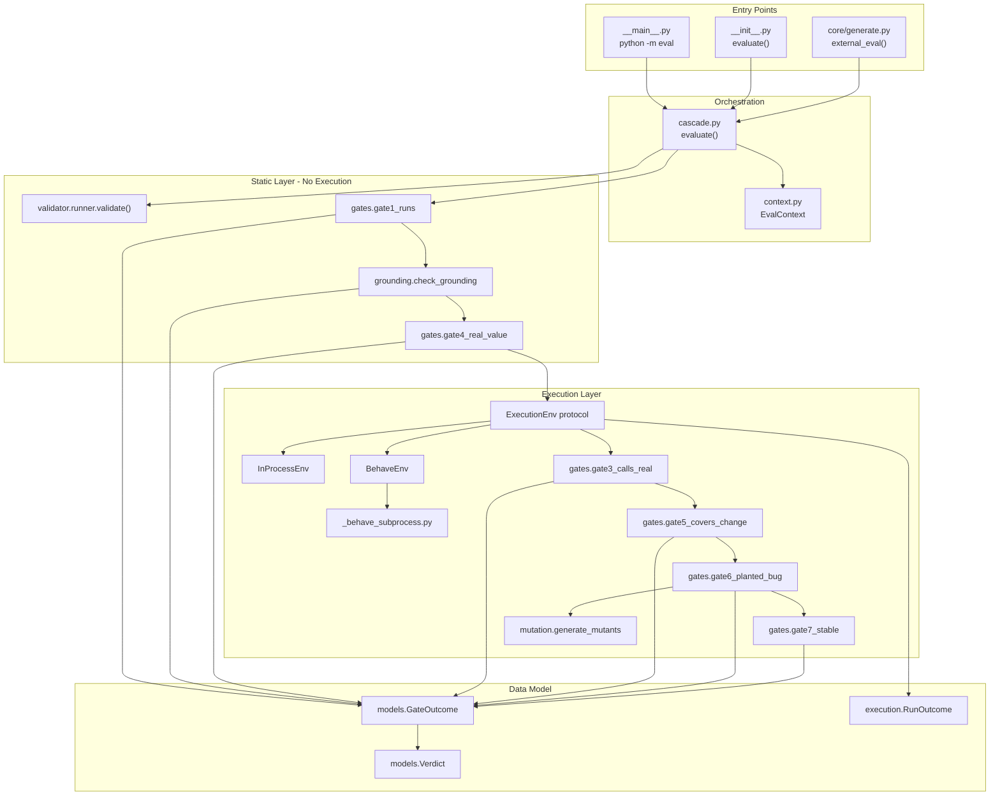
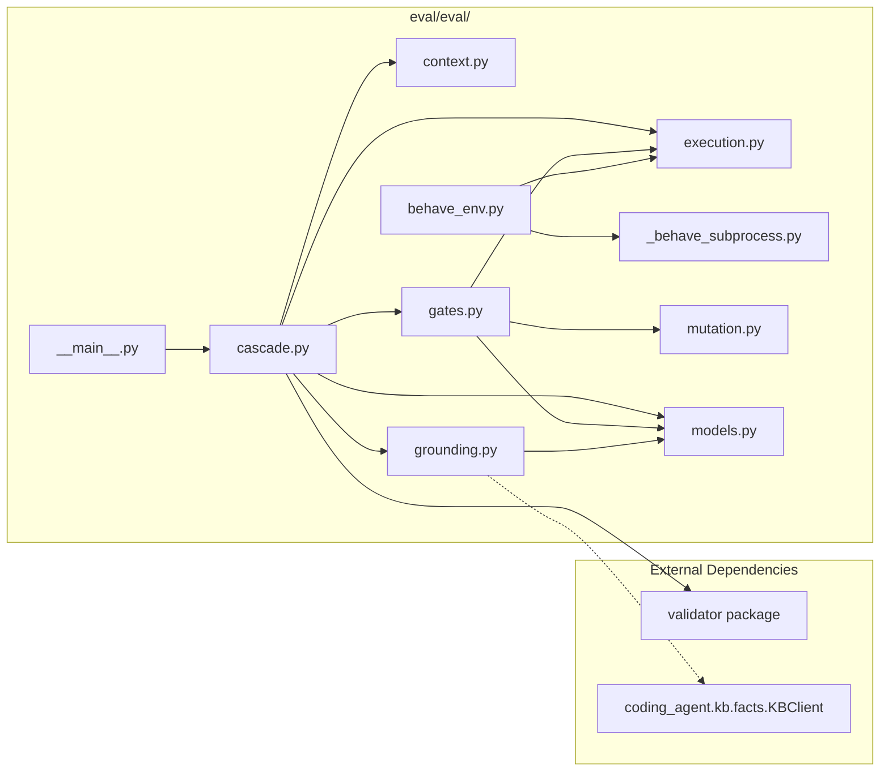
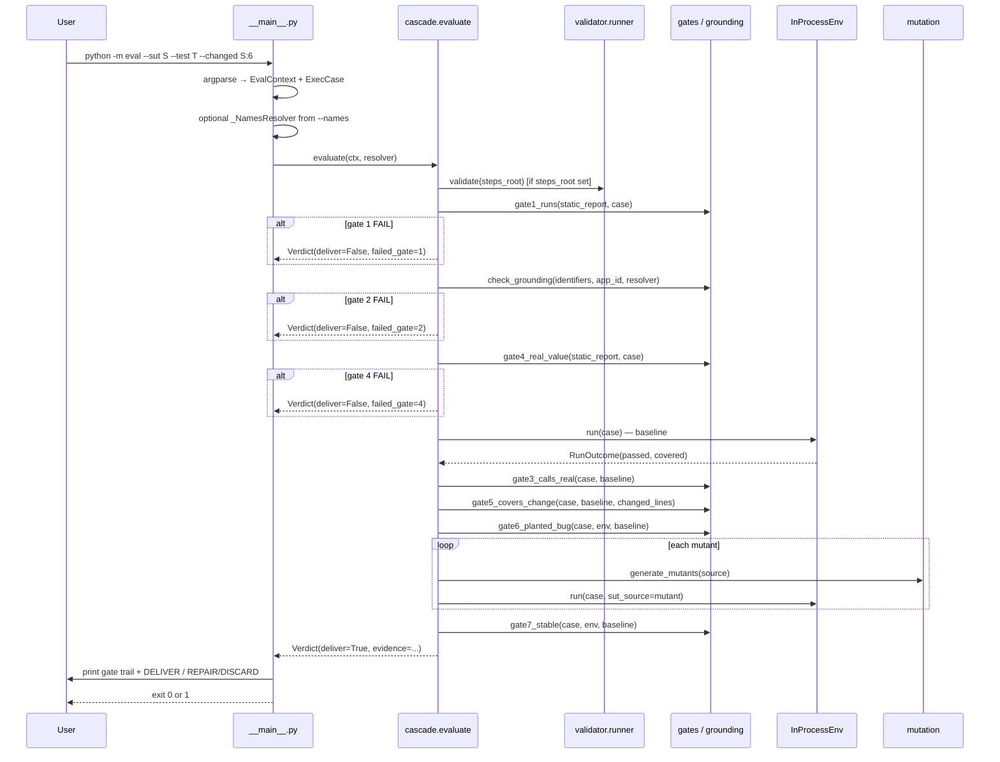
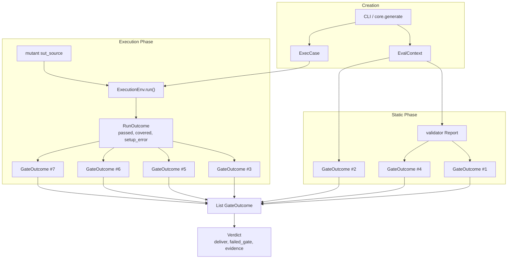

# Eval Module — Deep Architectural Review

**Audience:** Senior QA Automation Engineer with zero prior knowledge of this codebase.  
**Goal:** After reading this document, you can maintain, debug, and extend the Eval module without speaking to the original author.

**Module location:** `eval/eval/`  
**Entry points:** `python -m eval` (CLI) · `from eval import evaluate` (library) · `core.generate.external_eval` (pipeline integration)

---

# Part 1: Executive Summary

## What problem does Eval solve?

When an AI agent (or a human) writes a regression test for a code change, the test might:

- **Crash** before it runs (syntax errors, missing imports)
- **Reference fake names** that do not exist in the real system (hallucinated Lambda names, table names)
- **Look like it tests something** but assert on locally recomputed values instead of the system's actual output
- **Never call the real code** under test (in-memory fakes, mocks)
- **Miss the changed lines** introduced by the ticket
- **Pass even when the code is wrong** (the "fake-pass" class — the most dangerous failure mode)
- **Flap** between runs (nondeterministic)

Traditional CI only answers: *did the test pass?* Eval answers: *is this test **worthy of delivery** as a regression guard for this specific change?*

## Why does Eval exist?

The broader platform (`automated_ai_platform`) generates tests automatically. Without a deterministic quality judge, bad tests slip into the pipeline and create false confidence. Eval is **Component 3** in the pipeline:

```
Ingestion → Coding Agent → Eval
```

Eval **contains** the static `validator` package as its cheap pre-execution layer, then adds gates that require **running** the test against real code.

## What input does Eval receive?

| Input | Type | Source |
|-------|------|--------|
| SUT path | `ExecCase.sut_path` | The `.py` file being changed |
| Test path | `ExecCase.test_path` | A module with `def run(sut):` **or** Behave step files (via `BehaveEnv`) |
| Changed lines | `EvalContext.changed_lines` | `{sut_path: {line_numbers}}` from unified diff |
| Identifiers to ground | `EvalContext.identifiers` | `[(name, kind), ...]` from agent's `TestBundle` |
| Step files root | `EvalContext.steps_root` | Optional folder for Behave static validation |
| Resolver | `Resolver` protocol | `KBClient` in production; `--names` file on CLI |
| Execution env | `ExecutionEnv` | `InProcessEnv` (default), `BehaveEnv`, or `SandboxEnv` |

## What output does Eval produce?

A **`Verdict`** object:

```python
Verdict(
    deliver: bool,              # THE answer: yes or no
    gates: List[GateOutcome],   # audit trail per gate
    failed_gate: Optional[int], # which gate stopped the cascade (if any)
    evidence: Dict[str, int],   # mutants_caught, lines_covered (ranking only, not a grade)
)
```

CLI exit code: `0` = delivered, `1` = not delivered.

## What does DELIVER mean?

**DELIVER** = every applicable gate **PASS**ed (or was **SKIP**ped because not applicable). The test is approved to ship as a regression guard for this change.

Example CLI output:
```
DELIVER — all gates passed (evidence: 8 mutants caught, 4 lines covered)
```

## What does REPAIR/DISCARD mean?

**REPAIR/DISCARD** = the cascade **stopped at the first FAIL**. The test is **not** delivered.

- **REPAIR:** The `Verdict.repair_findings` list contains structured `Finding` objects (same shape as `validator`) that the coding agent's bounded repair loop feeds back: *"fix exactly these issues and re-emit."* Up to 2 repair attempts in `core`.
- **DISCARD:** If repairs are exhausted, the ticket routes to a human with `failed_gate` and reasons.

Example CLI output:
```
REPAIR/DISCARD — failed at gate 6
```

---

# Part 2: Core Concept

## Why gates?

Gates decompose "is this test good?" into **independent, cheap-to-expensive checks**. Each gate asks one precise question. Benefits:

1. **Short-circuit:** Stop at first failure — don't run expensive mutation if the test doesn't parse.
2. **Actionable failures:** Each gate returns specific `Finding`s with `rule`, `message`, `suggestion`, `file`, `line`.
3. **Auditability:** The `gates` trail shows exactly what was checked and what passed.
4. **Separation of concerns:** Static checks (no execution) vs execution checks (run the test).

## Why a binary verdict instead of a score?

Scores invite threshold debates ("72% is probably fine"). In a regulated / high-stakes environment, a generated test either meets **all** quality bars or it does not. The design explicitly rejects:

- Weighted gate scores
- LLM-as-judge quality ratings
- Mutation percentage thresholds (suite-level critique from ICSE-2018 does not apply to per-change yes/no)

`evidence` counts (`mutants_caught`, `lines_covered`) exist only for **Pareto ordering among survivors** — never as a pass/fail grade.

## What problem is Eval trying to prevent?

| Failure class | Gate that catches it |
|---------------|---------------------|
| Syntax / load errors | Gate 1 |
| Hallucinated identifiers | Gate 2 |
| No real assertions | Gate 4 |
| Test never invokes SUT | Gate 3 |
| Test ignores the change | Gate 5 |
| **Fake-pass** (runs, "passes", verifies nothing) | **Gate 6** |
| Flaky tests | Gate 7 |

The **fake-pass** is the load-bearing threat: a test that *calls* real code and *has* assertions, but asserts on values it computed itself rather than the SUT's return value. See `examples/discount/test_fake.py`.

## How is Eval different from traditional test execution?

| Traditional (`pytest`, `behave`) | Eval |
|----------------------------------|------|
| Runs test, reports pass/fail | Runs test **plus** structural/semantic quality gates |
| One execution | Baseline + N mutant runs + stability re-runs |
| No grounding check | Re-verifies KB identifiers |
| No change coverage | Requires executing changed SUT lines |
| No mutation | Sabotages SUT output to detect hollow tests |

Eval does **not** replace `behave` or `pytest` — it **wraps** execution and adds quality criteria before delivery.

## How is Eval different from LLM-as-a-judge?

| LLM judge | Eval |
|-----------|------|
| Non-deterministic | 100% deterministic (stdlib `ast`, `sys.settrace`) |
| Subjective scoring | Binary pass/fail per gate |
| Can be fooled by plausible text | Catches fake-pass via output sabotage |
| Costs tokens | Zero LLM cost |
| Hard to repair from | Returns structured `Finding`s with file/line/suggestion |

---

# Part 3: Complete Architecture

## Architecture diagram



## Component diagram



## Module dependency diagram

```
__init__.py
  └── cascade.py
        ├── gates.py ──────► mutation.py
        │                 └── execution.py ──► (stdlib only)
        ├── grounding.py ──► models.py ──► validator.models
        ├── context.py ────► execution.py
        └── models.py

__main__.py
  └── cascade.py, context.py, execution.py, models.py

behave_env.py
  └── execution.py, _behave_subprocess.py

core/generate.py (caller)
  └── eval.evaluate, EvalContext, ExecCase
  └── eval.grounding.Resolver (KBClient satisfies structurally)
  └── core/execenv.py → BehaveEnv | InProcessEnv
```

## File reference

| File | Purpose | Responsibility | Dependencies | Called by | Returns |
|------|---------|----------------|--------------|-----------|---------|
| `__init__.py` | Public API surface | Re-exports `evaluate`, models, types | cascade, context, execution, grounding, models | `core`, tests, external code | — |
| `__main__.py` | CLI entry | Parse args, build `EvalContext`, print verdict | cascade, context, execution, models | `python -m eval` | exit code 0/1 |
| `cascade.py` | **Orchestrator** | Run gates cheapest-first, short-circuit on FAIL | gates, grounding, execution, models, validator | `__main__`, `__init__`, `core` | `Verdict` |
| `context.py` | Input bundle | Hold everything needed to judge one test | execution.ExecCase | cascade, callers | `EvalContext` |
| `execution.py` | Execution abstraction | Protocol + `InProcessEnv` reference impl | stdlib | cascade, gates, behave_env | `RunOutcome` |
| `behave_env.py` | Behave adapter | Run `.feature` bundles in subprocess | execution, _behave_subprocess | core/execenv.py | `RunOutcome` |
| `_behave_subprocess.py` | Subprocess worker | Fresh-process behave run + coverage trace | behave (runtime) | behave_env (subprocess) | JSON file |
| `grounding.py` | Gate 2 | KB identifier verification | models | cascade | `GateOutcome` |
| `mutation.py` | Gate 6 engine | AST output sabotage | stdlib ast | gates.gate6 | `List[Mutant]` |
| `models.py` | Data contracts | Verdict, GateOutcome, GateStatus | validator.models | all modules | dataclasses |
| `gates.py` | Gate implementations | Gates 1, 3, 4, 5, 6, 7 | execution, mutation, models | cascade | `GateOutcome` |

> **Note:** There is no `behave.py`. The Behave integration lives in `behave_env.py` + `_behave_subprocess.py`.

---

# Part 4: End-to-End Execution Flow

## Starting point: `python -m eval`



## Step-by-step trace

| Step | What | Why | File | Function |
|------|------|-----|------|----------|
| 1 | Parse CLI args | Build structured input | `__main__.py` | `main()` |
| 2 | Create `ExecCase(sut, test)` | Identify SUT and test module | `__main__.py` | `main()` |
| 3 | Parse `--changed` into `{path: {lines}}` | Gate 5 needs line numbers | `__main__.py` | `_parse_changed()` |
| 4 | Optional `_NamesResolver` | Gate 2 without live DB | `__main__.py` | `_NamesResolver` |
| 5 | Build `EvalContext` | Bundle all inputs | `__main__.py` | `EvalContext(...)` |
| 6 | Call `evaluate(ctx, resolver)` | Start cascade | `cascade.py` | `evaluate()` |
| 7 | Default `env = InProcessEnv()` | Reference execution | `cascade.py` | `evaluate()` |
| 8 | Optional `validator.validate(steps_root)` | Reuse static parse for gates 1 & 4 | `cascade.py` | imports `validator.runner.validate` |
| 9 | Gate 1 → 2 → 4 (static) | Cheapest first | `cascade.py` | `step(gate...)` |
| 10 | `env.run(case)` baseline | One run shared by gates 3/5/6/7 | `execution.py` | `InProcessEnv.run()` |
| 11 | Gates 3 → 5 → 6 → 7 | Execution quality | `cascade.py` + `gates.py` | various `gateN_*` |
| 12 | On first FAIL: return early | Short-circuit | `cascade.py` | `step()` returns True |
| 13 | All pass: `Verdict(deliver=True)` | Success | `cascade.py` | `evaluate()` |
| 14 | Print human or JSON output | CLI contract | `__main__.py` | `_print_human()` |

## Gate execution order vs design numbers

**Execution order (by cost):** 1 → 2 → 4 → *[baseline run]* → 3 → 5 → 6 → 7

**Design numbers** (used in `failed_gate`, docs): 1, 2, 3, 4, 5, 6, 7

Gate 4 runs before Gate 3 because checking for vacuous assertions is cheaper than executing the test.

---

# Part 5: The Seven Gates

## Gate 1 — Runs

| Aspect | Detail |
|--------|--------|
| **Business purpose** | Ensure the test can actually execute — no point running quality checks on broken code |
| **Technical purpose** | Parse SUT + test (or Behave step files via validator) |
| **Inputs** | `static_report` (optional), `ExecCase` |
| **Outputs** | `GateOutcome(1, "Runs", PASS\|FAIL)` |
| **Pass** | SUT and test compile/parse; step files have no syntax errors |
| **Fail** | `syntax-error`, `unreadable-file` findings |
| **PASS example** | Valid `calculator.py` + `test_late_fee.py` |
| **FAIL example** | `test.py` with `def run(sut): assert` (syntax error) |
| **Real-world** | Agent emitted step file with typo `improt boto3` |

**Implementation:** `gates.gate1_runs()` — uses `validator` report if `steps_root` set, else `ast.parse()` on SUT and test paths.

---

## Gate 2 — Grounded

| Aspect | Detail |
|--------|--------|
| **Business purpose** | Prevent tests that reference fake AWS resources, tables, endpoints |
| **Technical purpose** | Re-verify every emitted identifier exists in KB |
| **Inputs** | `identifiers: [(name, kind)]`, `app_id`, `resolver` |
| **Outputs** | `GateOutcome(2, "Grounded", PASS\|FAIL\|SKIP)` |
| **Pass** | Every identifier resolves to `canonical_name` with `resolved=True` |
| **Fail** | `ungrounded-identifier` finding per bad name |
| **SKIP** | No resolver supplied — grounding unknown, **not assumed pass** |
| **PASS example** | `--ground "late_fee:function" --names names.txt` with `late_fee` in file |
| **FAIL example** | Agent invented `execute_lambda_xyz` not in KB |
| **Real-world** | Test calls `FunctionName='aap_sandbox-nonexistent-lambda'` |

**Implementation:** `grounding.check_grounding()` — `Resolver` protocol, production drop-in is `KBClient.resolve()`.

---

## Gate 4 — Checks a Real Value

| Aspect | Detail |
|--------|--------|
| **Business purpose** | Catch tests that structurally assert nothing |
| **Technical purpose** | Detect no-op `then` steps (Behave) or vacuous `assert` (Python) |
| **Inputs** | `static_report`, `ExecCase` |
| **Outputs** | `GateOutcome(4, "Checks a real value", ...)` |
| **Pass** | At least one non-vacuous assertion |
| **Fail** | `no-op-step`, `no-assertion`, `vacuous-assert` |
| **PASS example** | `assert sut.late_fee(1000, 20) == 50.0` |
| **FAIL example** | `then` step with only `pass`; `assert True`; `assert x is not None` only |
| **Real-world** | Generated step: `@then("check result") def step(c): pass` |

**Note:** Gate 4 is the **cheap** fake-pass filter. Gate 6 is the **definitive** one.

---

## Gate 3 — Calls the Real Code

| Aspect | Detail |
|--------|--------|
| **Business purpose** | Ensure test exercises actual production code path |
| **Technical purpose** | SUT line coverage > 0 from baseline run |
| **Inputs** | `ExecCase`, `RunOutcome` (baseline) |
| **Outputs** | `GateOutcome(3, "Calls the real code", ...)` |
| **Pass** | `len(baseline.covered[sut_path]) > 0` |
| **Fail** | `no-real-invocation` — test never executed any SUT line |
| **PASS example** | Test calls `sut.late_fee(...)` |
| **FAIL example** | Test sets `context.result = 50` and asserts without calling SUT |
| **Real-world** | Behave step asserts on hardcoded JSON never invoking Lambda |

**Implementation:** Uses `sys.settrace` coverage from `InProcessEnv` or `_behave_subprocess`.

---

## Gate 5 — Covers the Change

| Aspect | Detail |
|--------|--------|
| **Business purpose** | Test must exercise the code that was actually changed |
| **Technical purpose** | `changed_lines ∩ covered_lines` non-empty |
| **Inputs** | `ExecCase`, baseline `RunOutcome`, `changed_lines` dict |
| **Outputs** | `GateOutcome(5, "Covers the change", PASS\|FAIL\|SKIP)` |
| **Pass** | At least one changed line was executed |
| **Fail** | `change-not-covered` |
| **SKIP** | No changed lines supplied |
| **PASS example** | `--changed calculator.py:7` and line 7 executed |
| **FAIL example** | Change on line 7 but test only hits `is_overdue()` on line 12 |
| **Real-world** | Fee logic changed but test only checks eligibility helper |

**Where changed lines come from:** `core.generate._parse_diff()` parses unified diff `+++` headers and `+` lines.

---

## Gate 6 — Catches a Planted Bug (MOST IMPORTANT)

| Aspect | Detail |
|--------|--------|
| **Business purpose** | Detect **fake-pass** tests — the #1 threat to automated test generation |
| **Technical purpose** | Mutation testing via output sabotage |
| **Inputs** | `ExecCase`, `ExecutionEnv`, baseline `RunOutcome`, `max_n` mutants |
| **Outputs** | `GateOutcome(6, "Catches a planted bug", ...)` with `data.mutants_caught` |
| **Pass** | Baseline passed **AND** test fails on ≥1 mutant |
| **Fail** | Baseline failed; or 0 mutants caught |
| **SKIP** | SUT has no return values to mutate |
| **PASS example** | `test_good.py` — asserts on `sut.apply_discount()` return value |
| **FAIL example** | `test_fake.py` — calls SUT but asserts on local `expected = round(...)` |
| **Real-world** | Test recomputes 10% fee locally instead of reading Lambda response |

### Why Gate 6 is the most important

Gates 1–5 can all pass on a sophisticated fake-pass:

```python
# test_fake.py — passes gates 1-5, FAILS gate 6
def run(sut):
    total = 100
    expected = round(total * 0.9, 2)
    sut.apply_discount(total, True)          # gate 3: calls real code ✓
    assert expected == round(total * 0.9, 2)  # gate 4: has assertion ✓
                                              # gate 6: sabotage return → still passes ✗
```

Only Gate 6 **sabotages the SUT's actual output** and verifies the test notices. This is deterministic, label-free, and cannot be gamed by plausible-looking assertions.

**Safety rules in gate6:**
1. Baseline must pass on correct code first
2. Must catch ≥1 of up to 8 mutants

---

## Gate 7 — Stable

| Aspect | Detail |
|--------|--------|
| **Business purpose** | Reject flaky tests before they enter the regression suite |
| **Technical purpose** | Re-run test N times; verdict must be identical |
| **Inputs** | `ExecCase`, `ExecutionEnv`, baseline, `runs` (default 3) |
| **Outputs** | `GateOutcome(7, "Stable", ...)` |
| **Pass** | Same pass/fail on every run |
| **Fail** | `flaky-test` — verdict changed |
| **PASS example** | Deterministic pure function test |
| **FAIL example** | Test depends on `time.time()` or random ordering |
| **Real-world** | Async test without proper wait/poll |

---

# Part 6: Data Flow



## Object lifecycle

### `EvalContext`

| Stage | Detail |
|-------|--------|
| **Created** | `__main__.py` from CLI args; `EvalContext.from_bundle()` in `core.generate` |
| **Fields** | `app_id`, `case`, `changed_lines`, `identifiers`, `steps_root`, `stability_runs`, `mutation_max` |
| **Mutated** | Never — immutable for one evaluation |
| **Consumed** | `cascade.evaluate()` reads all fields |

### `ExecCase`

| Stage | Detail |
|-------|--------|
| **Created** | Caller specifies `sut_path` and `test_path` |
| **Mutated** | Never |
| **Consumed** | Passed to every gate and every `env.run()` |

### `RunOutcome`

| Stage | Detail |
|-------|--------|
| **Created** | `ExecutionEnv.run()` after each execution |
| **Fields** | `passed: bool`, `covered: {sut_path: {line_nums}}`, `setup_error`, `output` |
| **Mutated** | New instance per run (baseline, each mutant, each stability run) |
| **Consumed** | Gates 3, 5, 6 (baseline check), 7 |

### `GateOutcome`

| Stage | Detail |
|-------|--------|
| **Created** | Each gate function |
| **Fields** | `number`, `name`, `status`, `detail`, `findings`, `data` |
| **Mutated** | Appended to `trail` list in cascade |
| **Consumed** | Built into `Verdict.gates`; FAIL findings → `repair_findings` |

### `Verdict`

| Stage | Detail |
|-------|--------|
| **Created** | `cascade.evaluate()` return |
| **Fields** | `deliver`, `gates`, `failed_gate`, `evidence` |
| **Consumed** | CLI print; `core.generate.external_eval`; repair loop via `repair_findings` |

---

# Part 7: SUT Deep Dive

## What is SUT?

**SUT = System Under Test** — the production code the regression test is meant to guard.

In Eval, the SUT is always a **file path** (`ExecCase.sut_path`), typically the `.py` file changed by the ticket. It is loaded as a Python module (in-process) or left on disk for Behave imports (subprocess).

## Why focus on SUT coverage?

The platform's failure mode is tests that **appear** to validate behaviour but never touch real code. SUT line coverage (via `sys.settrace`, not the `coverage` package) is the objective signal for Gate 3.

Coverage is stored as:
```python
RunOutcome.covered = {"/path/to/calculator.py": {6, 7, 12}}
```

## How coverage is collected

**InProcessEnv** (`execution.py` lines 86-89):
```python
def tracer(frame, event, arg):
    if frame.f_code.co_filename == target and event == "line":
        covered.add(frame.f_lineno)
    return tracer
sys.settrace(tracer)
run_fn(sut_mod)  # test's run(sut) entry point
```

**Behave subprocess** (`_behave_subprocess.py` lines 33-38): same tracer pattern, matches SUT by realpath + basename.

## Why Gate 3 depends on SUT execution

Gate 3 asks: *did any line of the SUT file execute?* If `covered[sut_path]` is empty, the test is decoration — it may parse and assert, but on values unrelated to running the SUT.

## Why Gate 5 depends on SUT coverage

Gate 5 intersects coverage with `changed_lines[sut_path]`:

```python
hit = changed & covered  # changed from diff, covered from baseline run
```

Example: change on line 7 (`return round(amount * 0.10, 2)`). Test must execute line 7, not just import the module.

---

# Part 8: Mutation Testing Deep Dive

## Why mutants are generated

To prove the test **notices wrong output**. If sabotaging a return value doesn't fail the test, the test is not anchored to the SUT's behaviour.

## How AST transformation works

`mutation.py` uses `ast.NodeTransformer`:

1. Parse SUT source to AST
2. Count `return` statements with values (`_value_returns`)
3. For each return ordinal × each sentinel, replace **one** return value
4. `ast.unparse()` back to source

## Output sabotage sentinels

```python
_SENTINELS = [
    ("None", lambda: ast.Constant(value=None)),
    ("0",    lambda: ast.Constant(value=0)),
    ("''",   lambda: ast.Constant(value="")),
    ("[]",   lambda: ast.List(elts=[], ctx=ast.Load())),
]
```

**Why return values?** Universal across arithmetic, strings, booleans — no operator-specific mutations needed.

## Complete walkthrough

**Original SUT** (`calculator.py`):
```python
def late_fee(amount, days_overdue):
    if days_overdue > 15:
        return round(amount * 0.05, 2)  # line 7
    return 0.0
```

**Generated mutant** (return#0→None):
```python
def late_fee(amount, days_overdue):
    if days_overdue > 15:
        return None   # sabotaged
    return 0.0
```

**Good test execution:**
```python
assert sut.late_fee(1000.0, 20) == 50.0  # AssertionError → passed=False → CAUGHT ✓
```

**Fake test execution:**
```python
expected = 50.0
sut.late_fee(1000.0, 20)  # ignores return
assert expected == 50.0     # still passes → NOT CAUGHT ✗
```

**Gate 6 verdict:** `caught 0/8` → **FAIL** → REPAIR/DISCARD

---

# Part 9: Grounding Deep Dive

## What grounding means

Every identifier the test uses (Lambda name, table, endpoint, parameter) must be a **real, resolved name** from the Knowledge Base — not invented by the AI.

## Why hallucinated identifiers are dangerous

A test calling `invoke(FunctionName='made-up-lambda')` will fail in production with `ResourceNotFoundException` — but might "pass" in a shallow mock environment. Gate 2 catches this **before** execution.

## How Resolver works

```python
class Resolver(Protocol):
    def resolve(self, query: str, kind: str = "any", app_id: str = "", limit: int = 10): ...
```

Production: `coding_agent.kb.facts.KBClient.resolve()` returns `GroundResult` with `candidates[].canonical_name` and `.resolved`.

CLI without DB: `_NamesResolver` in `__main__.py` — flat allow-list from `--names` file.

## Gate 2 logic

For each `(name, kind)` in `identifiers`:
1. Call `resolver.resolve(name, kind, app_id)`
2. Confirm exact match: `canonical_name == name AND resolved == True`
3. Else → `ungrounded-identifier` finding

**Critical:** No resolver → **SKIP**, not PASS. Grounding is never assumed.

---

# Part 10: Execution Layer Deep Dive

## ExecutionEnv (Protocol)

```python
class ExecutionEnv(Protocol):
    def run(self, case: ExecCase, sut_source: Optional[str] = None) -> RunOutcome: ...
```

**Extension point:** Swap `InProcessEnv` for `BehaveEnv` or `SandboxEnv` without changing the cascade.

## InProcessEnv

| Aspect | Detail |
|--------|--------|
| **Test contract** | Module with `def run(sut):` |
| **SUT loading** | `exec(compile(sut_source, sut_path, "exec"), module.__dict__)` |
| **Mutation** | `sut_source` param overrides disk content |
| **Pass semantics** | No exception = pass; `AssertionError` = fail (test noticed); other exception = setup_error |
| **Coverage** | `sys.settrace` on SUT filename |

## BehaveEnv

| Aspect | Detail |
|--------|--------|
| **Test contract** | `.feature` + `features/steps/*.py` |
| **Why subprocess** | Gate 6 runs many mutants; `sys.modules` caches SUT — mutants on disk would be ignored |
| **Mutation** | Writes mutant to disk, runs subprocess, restores original in `finally` |
| **Coverage** | Subprocess writes `covered: [lines]` to temp JSON |

## _behave_subprocess.py

Invoked as:
```
python _behave_subprocess.py <features_dir> <sut_path> <out_json>
```

Runs `behave.runner.Runner` with null formatter, traces SUT lines, writes:
```json
{"passed": true, "undefined": 0, "covered": [6, 7], "error": null}
```

## Why subprocess isolation exists

From `behave_env.py` docstring: In one interpreter, after baseline run, `import calculator` is cached. Gate 6 writes mutant to disk but Python keeps executing cached bytecode. **Fresh process per run** guarantees the file on disk is what executes — same principle as `mutmut` / `cosmic-ray`.

---

# Part 11: Call Graph

## Top-level

```
python -m eval
  └── __main__.main()
        └── cascade.evaluate(ctx, resolver)
              ├── validator.runner.validate()          [if steps_root]
              ├── gates.gate1_runs()
              ├── grounding.check_grounding()
              ├── gates.gate4_real_value()
              ├── ExecutionEnv.run()                   [baseline]
              │     └── InProcessEnv.run()
              │           ├── compile+exec SUT
              │           ├── compile+exec test
              │           └── run_fn(sut_mod) + settrace
              ├── gates.gate3_calls_real()
              ├── gates.gate5_covers_change()
              ├── gates.gate6_planted_bug()
              │     ├── generate_mutants()
              │     └── ExecutionEnv.run(sut_source=mutant)  [×N]
              └── gates.gate7_stable()
                    └── ExecutionEnv.run()  [×(runs-1)]
```

## gate6 internal

```
gate6_planted_bug()
  ├── assert baseline.passed
  ├── read SUT source from disk
  ├── generate_mutants(source, path, max_n)
  │     ├── _value_returns() → count returns
  │     └── _ReplaceOneReturn.visit_Return() × sentinels
  └── for mutant in mutants:
        env.run(case, sut_source=mutant.source)
        if not outcome.passed: caught += 1
```

## core integration

```
core.generate.generate()
  └── external_eval(bundle)
        ├── EvalContext.from_bundle(bundle, ...)
        └── evaluate(ctx, env=BehaveEnv|InProcessEnv, resolver=KBClient)
```

---

# Part 12: Function Reference

## Public API (`__init__.py`)

| Symbol | Purpose |
|--------|---------|
| `evaluate` | Main entry — run cascade |
| `EvalContext` | Input bundle dataclass |
| `ExecCase` | SUT + test paths |
| `ExecutionEnv` | Protocol for execution backends |
| `InProcessEnv` | Default stdlib execution |
| `RunOutcome` | Result of one test run |
| `Resolver` | Protocol for KB grounding |
| `Verdict` | Final deliver/reject decision |
| `GateOutcome`, `GateStatus` | Per-gate result types |
| `Finding`, `Severity` | Re-exported from validator |

## `cascade.evaluate(ctx, env=None, resolver=None) -> Verdict`

| | |
|--|--|
| **Purpose** | Orchestrate all gates |
| **Parameters** | `ctx: EvalContext`, optional `env`, optional `resolver` |
| **Returns** | `Verdict` |
| **Side effects** | Reads files, executes test, may write mutant to disk (BehaveEnv) |
| **Callers** | `__main__`, `core.generate` |
| **Callees** | all gate functions, `env.run()` |

## `gates.gate1_runs(static_report, case) -> GateOutcome`

| | |
|--|--|
| **Purpose** | Verify parseability |
| **Pass** | No syntax errors |
| **Callees** | `ast.parse` or validator findings filter |

## `gates.gate4_real_value(static_report, case) -> GateOutcome`

| | |
|--|--|
| **Purpose** | Detect empty/vacuous assertions |
| **Callees** | `ast.walk` for `Assert` nodes, `vacuous()` helper |

## `gates.gate3_calls_real(case, baseline) -> GateOutcome`

| | |
|--|--|
| **Purpose** | SUT coverage > 0 |
| **Inputs** | `baseline.covered` |

## `gates.gate5_covers_change(case, baseline, changed_lines) -> GateOutcome`

| | |
|--|--|
| **Purpose** | Changed ∩ covered non-empty |
| **SKIP** | No changed lines for SUT |

## `gates.gate6_planted_bug(case, env, baseline, max_n=8) -> GateOutcome`

| | |
|--|--|
| **Purpose** | Mutation testing |
| **Callees** | `generate_mutants`, `env.run` per mutant |

## `gates.gate7_stable(case, env, baseline, runs=3) -> GateOutcome`

| | |
|--|--|
| **Purpose** | Determinism check |
| **Callees** | `env.run` × (runs-1) |

## `grounding.check_grounding(identifiers, app_id, resolver) -> GateOutcome`

| | |
|--|--|
| **Purpose** | Gate 2 KB verification |
| **SKIP** | `resolver is None` |

## `mutation.generate_mutants(source, path, max_n=8) -> List[Mutant]`

| | |
|--|--|
| **Purpose** | Create output-sabotage variants |
| **Returns** | Up to `max_n` distinct `Mutant(label, source)` |
| **Side effects** | None (pure AST transform) |

## `InProcessEnv.run(case, sut_source=None) -> RunOutcome`

| | |
|--|--|
| **Purpose** | Execute `run(sut)` test against SUT |
| **Side effects** | `sys.settrace` during execution |

## `BehaveEnv.run(case, sut_source=None) -> RunOutcome`

| | |
|--|--|
| **Purpose** | Execute Behave bundle in subprocess |
| **Side effects** | May overwrite SUT file temporarily |

## `EvalContext.from_bundle(bundle, app_id, case, ...) -> EvalContext`

| | |
|--|--|
| **Purpose** | Adapt coding agent `TestBundle` to eval input |
| **Extracts** | `grounded_identifiers` → `identifiers` list |

## `Verdict.repair_findings -> List[Finding]`

| | |
|--|--|
| **Purpose** | All findings from FAIL gates — fed to agent repair loop |

---

# Part 13: Recommended Reading Order

| Order | File | Why |
|-------|------|-----|
| **1** | `README.md` | 10-minute orientation: gates, philosophy, CLI examples |
| **2** | `models.py` | Understand `Verdict`, `GateOutcome`, `GateStatus` — the output vocabulary |
| **3** | `execution.py` | `ExecCase`, `RunOutcome`, `InProcessEnv` — what "running a test" means here |
| **4** | `cascade.py` | **The spine** — gate order, short-circuit, 69 lines, read entirely |
| **5** | `gates.py` | Each gate's pass/fail logic — where bugs are found |
| **6** | `mutation.py` | Gate 6 engine — smallest file, highest impact |
| **7** | `grounding.py` | Gate 2 — short, important for KB integration |
| **8** | `context.py` | How inputs are bundled |
| **9** | `__main__.py` | CLI wiring |
| **10** | `behave_env.py` + `_behave_subprocess.py` | Only if you work on Behave path |
| **11** | `examples/discount/` | `test_good.py` vs `test_fake.py` — concrete PASS/FAIL |
| **12** | `tests/` | How to test gates in isolation (`fakes.py`) |

**Do not start with** `behave_env.py` — understand `InProcessEnv` + `cascade.py` first.

---

# Part 14: Explain Like I'm Five

## Analogy: Airport Security for a Test

Imagine a **test** is a passenger trying to board a **flight** (ship to production as a regression guard). The **SUT** is the airplane they're supposed to inspect.

| Gate | Security checkpoint |
|------|---------------------|
| **Gate 1 — Runs** | Does the passenger have valid ID and ticket? (Can the file even load?) |
| **Gate 2 — Grounded** | Is the destination on the real flight schedule? (Are names in the KB?) |
| **Gate 4 — Real value** | Are they actually carrying luggage, or an empty suitcase? (Real assertions?) |
| **Gate 3 — Calls real code** | Did they walk onto the actual airplane, or just look at a photo? (SUT executed?) |
| **Gate 5 — Covers change** | Did they inspect the part that was **just repaired**? (Changed lines hit?) |
| **Gate 6 — Planted bug** | Security secretly breaks the airplane seat and watches: does the inspector notice? (Mutation) |
| **Gate 7 — Stable** | Ask the same question three times — same answer? (No flakiness) |

**DELIVER** = cleared all checkpoints → passenger boards.  
**REPAIR/DISCARD** = stopped at a checkpoint → go fix your documents (repair) or see a human (discard).

**Gate 6 is the metal detector** — the one that catches people who *look* like they're inspecting but aren't really paying attention. The 2025 fake-pass scandal is someone who walked past every checkpoint except the one that secretly breaks something.

---

# Part 15: Line-by-Line Walkthrough Preparation

## `cascade.py` (69 lines — read entirely)

| Block | Lines | Role |
|-------|-------|------|
| Module docstring | 1-13 | Philosophy: cheapest-first, no score |
| `evaluate()` signature | 25-27 | Public API |
| `step()` helper | 31-34 | Append outcome; return True on FAIL → short-circuit |
| Static layer | 36-48 | Validator + gates 1, 2, 4 |
| Baseline run | 50-51 | **Single shared execution** |
| Execution gates | 53-60 | Gates 3, 5, 6, 7 |
| Success path | 62-68 | Build evidence, `deliver=True` |

**Critical line 51:** `baseline = env.run(ctx.case)` — one run, many gates inspect it.  
**Critical line 57:** Gate 6 receives `env` for mutant re-runs.

## `gates.py` (199 lines)

| Function | Lines | Key logic |
|----------|-------|-----------|
| `_err()` | 20-23 | Factory for ERROR `Finding` |
| `gate1_runs` | 27-49 | Validator or ast.parse fallback |
| `gate4_real_value` | 53-97 | `vacuous()` detects `assert True`, `is not None` |
| `gate3_calls_real` | 101-117 | `len(covered) > 0` |
| `gate5_covers_change` | 121-137 | Set intersection |
| `gate6_planted_bug` | 141-181 | Baseline check → mutants → count caught |
| `gate7_stable` | 185-198 | `len(verdicts) == 1` |

## `execution.py` (104 lines)

| Block | Lines | Role |
|-------|-------|------|
| `RunOutcome` | 29-34 | passed + covered + setup_error |
| `ExecCase` | 37-40 | sut_path, test_path |
| `ExecutionEnv` Protocol | 43-44 | Extension point |
| `InProcessEnv.run` | 53-103 | Load → trace → run_fn(sut) |

**Critical lines 96-99:** `AssertionError` = test failed (good for mutants); other exceptions = setup_error.

## `mutation.py` (82 lines)

| Block | Lines | Role |
|-------|-------|------|
| `_SENTINELS` | 30-35 | Four sabotage values |
| `_ReplaceOneReturn` | 38-52 | AST transformer |
| `generate_mutants` | 61-81 | Nested loop: return ordinal × sentinel |

## `grounding.py` (53 lines)

| Block | Lines | Role |
|-------|-------|------|
| `Resolver` Protocol | 19-20 | Duck-typed KB interface |
| `check_grounding` | 23-52 | SKIP if no resolver; else verify each identifier |

## `context.py` (45 lines)

| Block | Lines | Role |
|-------|-------|------|
| `EvalContext` dataclass | 19-28 | All inputs in one place |
| `from_bundle` | 30-44 | Bridge from coding agent output |

## `models.py` (71 lines)

| Block | Lines | Role |
|-------|-------|------|
| `GateStatus` | 22-25 | PASS / FAIL / SKIP |
| `GateOutcome` | 28-45 | Per-gate result + `to_dict()` |
| `Verdict` | 48-70 | `repair_findings` property aggregates FAIL findings |

## `behave_env.py` (115 lines)

| Block | Lines | Role |
|-------|-------|------|
| `run()` | 48-68 | Stage mutant → run → restore |
| `_run_behave()` | 70-106 | Subprocess + JSON parse |

## `_behave_subprocess.py` (78 lines)

| Block | Lines | Role |
|-------|-------|------|
| `tracer` | 33-39 | SUT line coverage in subprocess |
| `Runner.run()` | 56-61 | Behave execution under trace |

## `__main__.py` (127 lines)

| Block | Lines | Role |
|-------|-------|------|
| `_NamesResolver` | 34-45 | CLI grounding without DB |
| `_parse_changed` | 48-56 | `path:1,2,3` → dict |
| `main()` | 68-103 | Wire CLI → evaluate → print |

---

# Appendix: Running Examples

```powershell
$env:PYTHONPATH = "<repo-root>\eval;<repo-root>\validator"

# DELIVER — good test
py -3.12 -m eval --sut eval\eval\examples\discount\sut.py `
  --test eval\eval\examples\discount\test_good.py `
  --changed eval\eval\examples\discount\sut.py:6

# REPAIR/DISCARD — fake-pass dies at gate 6
py -3.12 -m eval --sut eval\eval\examples\discount\sut.py `
  --test eval\eval\examples\discount\test_fake.py `
  --changed eval\eval\examples\discount\sut.py:6

# Dummy demo
py -3.12 -m eval --sut dummy_demo\calculator.py `
  --test dummy_demo\test_late_fee.py `
  --changed dummy_demo\calculator.py:6
```

## Test suite

```powershell
py -3.12 -m pytest eval\eval\tests -q
```

17 tests using `FakeEnv`, `FakeResolver` — no live DB or Behave required for most gate logic.

---

*Document version: aligned with `eval/eval/` as of repository snapshot. For platform context see `README.md` and `docs/onboarding/`.*
